# Xv6 实验报告
## 环境配置
使用版本：xv6-2020  
### 安装依赖
- sudo apt update
- sudo apt install git build-essential gdb qemu-system-x86
- sudo apt install gcc-riscv64-unknown-elf
- sudo apt install qemu-system-misc
### 获取xv6源代码
- git clone git://g.csail.mit.edu/xv6-labs-2020
### 切换实验分支
- git checkout util
### 编译运行
- make clean
- make qemu
### 实验环境测试
- ls指令

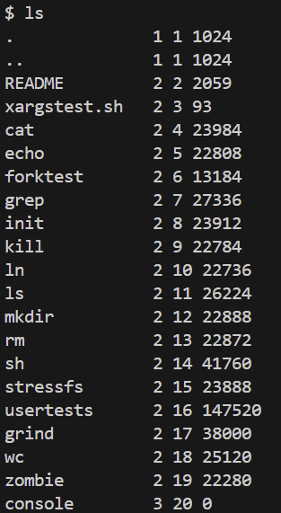  

## 阅读源码
### user.h
了解系统调用接口和用户库函数。  
```c
/* 文件状态信息结构体（具体定义在其他地方） */
struct stat;
/* 实时时钟日期结构体（具体定义在其他地方） */
struct rtcdate;

/*************** 系统调用接口 ***************/

// 进程管理相关
int fork(void);                     // 创建一个新进程（子进程），返回子进程PID，父进程返回子进程PID，子进程返回0
int exit(int) __attribute__((noreturn)); // 终止当前进程，status参数传递给父进程，noreturn表示此函数不会返回
int wait(int* status);               // 等待任意子进程退出，并将退出状态存入status指针指向的位置
int kill(int pid);                   // 杀死指定PID的进程
int getpid(void);                    // 获取当前进程的PID
int exec(char* path, char** argv);   // 执行指定路径的程序，替换当前进程映像

// 文件I/O相关
int open(const char* path, int mode); // 打开文件，返回文件描述符
int close(int fd);                   // 关闭文件描述符
int read(int fd, void* buf, int n);  // 从文件描述符读取n字节到buf
int write(int fd, const void* buf, int n); // 将buf中的n字节写入文件描述符
int pipe(int* fds);                  // 创建管道，fds[0]为读端，fds[1]为写端
int dup(int fd);                     // 复制文件描述符，返回新的描述符

// 文件系统操作
int mknod(const char* path, short major, short minor); // 创建设备文件
int unlink(const char* path);        // 删除文件（减少链接计数）
int link(const char* old, const char* new); // 创建硬链接
int mkdir(const char* path);         // 创建目录
int chdir(const char* path);         // 改变当前工作目录
int fstat(int fd, struct stat* st);  // 获取文件状态信息

// 内存管理
char* sbrk(int n);                   // 调整进程数据段大小，返回新内存起始地址

// 其他功能
int sleep(int ticks);                // 使进程休眠指定ticks时间
int uptime(void);                   // 获取系统启动后的ticks数

/*************** 用户库函数 (ulib.c) ***************/

// 文件操作
int stat(const char* path, struct stat* st); // 获取文件状态信息（用户态封装）

// 字符串处理
char* strcpy(char* dst, const char* src); // 字符串复制
char* strchr(const char* s, char c);     // 查找字符c在字符串s中的位置
int strcmp(const char* s1, const char* s2); // 字符串比较
uint strlen(const char* s);              // 计算字符串长度
int atoi(const char* s);                 // 字符串转整数

// 内存操作
void* memmove(void* dst, const void* src, int n); // 安全的内存移动（处理重叠区域）
void* memset(void* dst, int c, uint n);  // 内存填充
int memcmp(const void* s1, const void* s2, uint n); // 内存区域比较
void* malloc(uint size);                // 动态内存分配
void free(void* ptr);                  // 释放动态内存

// 输入输出
void printf(const char* fmt, ...);      // 格式化输出到标准输出
void fprintf(int fd, const char* fmt, ...); // 格式化输出到指定文件描述符
char* gets(char* buf, int max);        // 从标准输入读取一行（不安全，不检查缓冲区溢出）
```
### user / echo.c
熟悉 xv6 编码风格，解如何获取传递给程序的命令行参数。
```c
#include "kernel/types.h"
#include "kernel/stat.h"
#include "user/user.h"

int
main(int argc, char *argv[])
{
  int i;

  for(i = 1; i < argc; i++){
    write(1, argv[i], strlen(argv[i]));
    if(i + 1 < argc){
      write(1, " ", 1);
    } else {
      write(1, "\n", 1);
    }
  }
  exit(0);
}
```
## Lab Utilities
### sleep
#### 实验目的
在 xv6 操作系统中实现一个用户级的 sleep 程序。该程序的功能是接收一个命令行参数作为需要暂停的时钟周期数，并在此期间暂停自身的执行。  
通过完成本次实验，旨在深入理解以下几个关键概念：  
- 如何在 C 语言 main 函数中处理命令行参数（argc 和 argv）。
- 从用户空间调用一个已有的系统调用（sleep( )）。
- 熟悉xv6编码风格
#### 实验原理
本次实验的核心原理是，在 xv6 操作系统中编写一个作为用户与内核交互桥梁的 sleep 命令行应用程序。该程序通过 main 函数的 argc 和 argv 参数接收并解析用户从命令行传入的时间参数，并使用 atoi 库函数将其从字符串转换为整数。随后，当程序调用在 user / user.h 中声明的 sleep( ) 函数时，其底层实现并非普通的C代码，而是执行了一段位于 user / usys.S 中的汇编代码存根。这段汇编代码首先将 sleep 系统调用所对应的唯一编号（SYS_sleep）加载到专用的 a7 寄存器中，以此向内核表明请求的服务类型；紧接着，它执行关键的 ecall 指令。该指令会触发一次硬件“陷阱”（trap），使 CPU 立即从用户态安全地切换到内核态，并将控制权交给内核。内核捕获到该请求后，执行其内部的 sys_sleep 函数，将该进程置为休眠状态，并在指定数量的时钟中断发生后将其唤醒。整个过程实践了如何编写一个标准的用户程序来利用操作系统提供的系统调用接口，以完成特定功能。
#### 实验步骤
- 创建源文件：在 user / 目录下创建源文件 sleep.c 。
- 注册新程序：为了让 xv6 的构建系统能够识别、编译并链接我们的 sleep.c 文件，必须修改项目根目录下的 Makefile 。在 UPROGS 变量的列表中，添加 $U/_sleep\ 一项。
- sleep.c 的代码实现。
    ```c
    #include "kernel/types.h"
    #include "kernel/stat.h"
    #include "user/user.h"

    int 
    main(int argc, char *argv[])
    {
        if(argc < 2)
        {
            fprintf(2, "Usage: sleep time...\n"); // 2表示标准错误输出的文件描述符
            exit(1); // 1表示退出失败，0表示退出成功
        }
        int time = atoi(argv[1]);
        sleep(time);
        exit(0);
    }
    ```
#### 测试结果
在执行 sleep 30 后，系统提示符 $ 消失，统出现明显停顿，大约 3 秒后，提示符重新出现，可以输入下一条命令。这表明 sleep 程序成功调用了系统调用，并按预期暂停了执行。
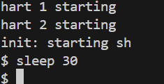
### pingpong
#### 实验目的
在 xv6 操作系统中实现一个用户级的 pingpong 程序。该程序的功能是使用管道在父进程和子进程之间进行双向通信，父进程发送“ping”消息给子进程，子进程接收后回复“pong”消息给父进程。  
通过完成本次实验，旨在深入理解以下几个关键概念：
- 进程管理：如何使用 fork( ) 系统调用创建子进程，理解父子进程的执行流程和生命周期管理。
- 进程间通信：如何使用 pipe( ) 系统调用创建管道，实现父子进程之间的数据传输和同步。
- 文件描述符管理：理解管道的读写端概念，学会正确关闭不需要的文件描述符以避免资源泄漏。
- 系统调用的协调使用:
    - pipe( ) - 创建通信管道
    - fork( ) - 创建子进程
    - read( ) / write( ) - 进行管道读写操作
    - wait( ) - 父进程等待子进程结束
- 进程同步：理解父子进程之间的执行顺序控制，确保消息传递的正确性。
#### 实验原理
- 管道  
管道是 Unix 系统中进程间通信的重要机制，它提供了一种在相关进程之间传输数据的方式。
    - 管道是一个单向的数据通道，数据只能从一端写入，从另一端读出。
    - 管道具有读端和写端，通过文件描述符进行访问。
    - 管道是内核缓冲区，当缓冲区满时写操作会被阻塞，当缓冲区空时读操作会被阻塞。  

    pipe( ) 系统调用：
    ```c
    int pipe(int pipefd[2]);
    ```
    创建一个管道，返回两个文件描述符，pipefd[0] 表示读端，pipefd[1] 表示写端，成功返回 0，失败返回 -1。
- fork( ) 系统调用  
fork( ) 是创建新进程的系统调用，它会创建当前进程的一个完全相同的副本。
    ```c
    pid_t fork(void);
    ```
    - 在父进程中返回子进程的 PID 。
    - 在子进程中返回 0。
    - 出错时返回 -1。
父子进程共享相同的代码，子进程获得父进程数据段的完整副本，子进程继承父进程的文件描述符表。
#### 实验步骤
- 创建管道：使用 pipe( ) 创建通信管道，实现双向通信需要创建两个管道。
- 创建子进程：使用 fork( ) 创建子进程。
- 关闭不需要的端口：父子进程各自关闭不需要的管道端口，如父进程关闭管道 1 的读端口和管道 2 的写端口。
- 进行通信：通过 read( ) 和 write( ) 进行数据传输。
- 同步等待：父进程使用 wait( ) 等待子进程结束。
- 资源清理：关闭管道，进程正常退出。
```c
#include "kernel/types.h"
#include "kernel/stat.h"
#include "user/user.h"

int 
main(int argc, char *argv[])
{
    int p1[2], p2[2];  // 两个管道：p1用于父->子，p2用于子->父
    int pid;
    char buf[64];  // 用于读取数据的缓冲区
    
    // 创建两个管道
    if (pipe(p1) < 0) {
        printf("pipe p1 failed\n");
        exit(1);
    }
    if (pipe(p2) < 0) {
        printf("pipe p2 failed\n");
        exit(1);
    }

    // 创建子进程
    pid = fork();
    if (pid < 0) {
         printf("fork failed\n");
         exit(1);
    }

    // 子进程
    if (pid == 0) {
        close(p1[1]);  // 子进程不需要对管道1进行写操作
        close(p2[0]);  // 子进程不需要对管道2进行读操作

        // 从p1读取父进程发送的数据
        if (read(p1[0], buf, sizeof(buf) > 0))
            printf("<%d>: received ping\n", getpid());

        // 向p2写入数据给父进程
        write(p2[1], "pong", 4);
        
        // 关闭剩余的文件描述符
        close(p1[0]);
        close(p2[1]);

        exit(0);
    }
    // 父进程
    else {
        close(p1[0]);  // 父进程不需要对管道1进行读操作
        close(p2[1]);  // 父进程不需要对管道2进行写操作

        // 向p1写入数据给子进程
        write(p1[1], "ping", 4);

        // 从p2读取子进程发送的数据
        if (read(p2[0], buf, sizeof(buf) > 0))
            printf("<%d>: received pong\n", getpid());

        // 等待子进程结束
        wait(0);

        // 关闭剩余的文件描述符
        close(p1[1]);
        close(p2[0]);

        exit(0);
    }

    return 0;
}
```
#### 测试结果
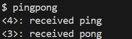
### primes
#### 实验目的
在 xv6 操作系统中实现一个用户级的 primes 程序。该程序的功能是使用埃拉托斯特尼筛法（Sieve of Eratosthenes）通过管道和多进程协作来筛选并输出指定范围内的所有素数。  
通过完成本次实验，旨在深入理解以下几个关键概念：
- 多进程协作模式：如何设计和实现多个进程协同工作的筛选算法，每个进程负责筛选一个特定素数的倍数。
- 递归进程创建：掌握在每个筛选进程中递归地创建下一级子进程的技术，形成进程链式结构。
- 管道链式通信：学会构建多级管道连接，实现数据在进程链中的顺序传递和过滤，理解管道作为进程间通信媒介的高级应用。
- 文件描述符的精确管理：深入理解在复杂的多进程多管道环境中如何正确关闭不需要的文件描述符，避免资源泄漏和死锁。
- 进程生命周期控制：掌握如何确保所有子进程正确退出，避免僵尸进程和内存泄漏，理解 wait( ) 系统调用在进程链中的作用。
#### 实验原理
##### 埃拉托斯特尼筛法
埃拉托斯特尼筛法是一种古老而高效的素数筛选算法，其基本思想是：  
1. 初始化：创建一个包含从 2 到 n 的所有整数的列表。
2. 筛选过程：
    - 取列表中的第一个数字（必定是素数）。
    - 将该素数的所有倍数从列表中删除。
    - 重复此过程，直到处理完所有数字。
##### 分布式多进程实现原理
1. 进程链式结构设计  
在 xv6 中，我们将串行的筛选过程转换为分布式的多进程协作模式，每个筛选进程负责：  
    - 接收来自上一级进程的数据流。
    - 筛选出第一个数字作为素数输出。
    - 过滤掉该素数的所有倍数。
    - 将剩余数字传递给下一级进程。
2. 管道通信机制  
管道作用：  
    - 连接相邻的两个进程。
    - 实现数据的单向传输。
    - 提供进程间同步机制。  
#### 实验步骤
- 设计程序结构
    - main( ) 函数：负责初始化和数据生成。
    - sieve( ) 函数：实现递归筛选逻辑。
- main( ) 函数逻辑  
    - 创建第一个管道。
    - 初始化数据。
    - 开始递归。
    ```c
    int 
    main(int argc, char *argv[])
    {
        int p[2];
        
        // 1. 创建第一个管道
        if (pipe(p) < 0) {
            fprintf(2, "pipe failed\n");
            exit(1);
        }
        
        // 2. 创建第一个筛选进程
        if (fork() == 0) {
            // 子进程：第一个筛选进程
            close(p[1]);  // 关闭写端
            sieve(p[0]);  // 开始筛选
            exit(0);
        } else {
            // 父进程：生成2到35的所有数字
            close(p[0]);  // 关闭读端
            
            // 3. 写入数字序列
            for (int i = 2; i <= 35; i++) {
                write(p[1], &i, sizeof(i));
            }
            
            // 4. 关闭管道并等待
            close(p[1]);  // 关闭写端
            wait(0);      // 等待子进程完成
        }
        
        exit(0);
    }
    ```
- sieve( ) 函数逻辑  
    - 打印第一个数字，一定是素数。
    - 创建新管道。
    - 父进程：从上一层管道读取数据，进行筛选，过滤第一个数字及其倍数，将剩余数字写入新管道。
    - 子进程：将新管道的读端作为参数进行递归过滤。
    - 关闭文件描述符，控制进程生命周期。
    ```c
    void
    sieve(int input_fd)
    {
        int prime,n;

        // 读取第一个数字，它必定是素数
        if (read(input_fd, &prime, sizeof(prime)) == 0) {
            close(input_fd);  // 确保关闭文件描述符
            exit(0);  // 没有更多数字，退出
        }

        printf("prime %d\n", prime);

        // 创建管道给下一个筛选进程
        int p[2];
        if (pipe(p) < 0) {
            fprintf(2, "pipe failed\n");
            exit(1);
        }

        if (fork() == 0) {
            // 子进程：下一个筛选层
            close(p[1]);  // 关闭写端
            close(input_fd);  // 关闭上一层的管道
            sieve(p[0]);  // 用新管道的读端作为input_fd
            exit(0);
        } else {
            // 父进程
            close(p[0]);  // 关闭新管道的读端

            // 筛选数据
            while (read(input_fd, &n, sizeof(n)) > 0) {
                if (n % prime != 0) {
                    write(p[1], &n, sizeof(n));
                }
            }

            close(input_fd);  // 关闭上一层的管道
            close(p[1]);  // 关闭新管道的写端
            wait(0);  // 等待子进程完成
            exit(0);
        }
    }
    ```
- 编译配置  
在 Makefile 中添加 primes 程序到用户程序列表：
#### 测试结果
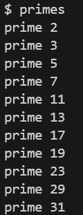
### find
#### 实验目的
在 xv6 操作系统中实现一个用户级的 find 程序。该程序的功能是在指定目录及其子目录中递归搜索具有特定名称的文件或目录，并输出匹配项的完整路径。  
通过完成本次实验，旨在深入理解以下几个关键概念：
- 文件系统结构理解：深入学习 xv6 文件系统的组织结构，理解目录项（dirent）、文件状态（stat）和文件类型（T_FILE、T_DIR）等核心概念。
- 递归目录遍历：掌握如何使用递归算法遍历目录树结构，实现深度优先搜索模式，确保能够搜索到所有层级的子目录。
- 文件系统系统调用的综合运用：
    - open( ) - 打开文件或目录
    - read( ) - 读取目录项信息
    - fstat( ) / stat( ) - 获取文件状态信息
    - close( ) - 关闭文件描述符
- 目录项处理技术：学会正确解析目录项结构（struct dirent），理解 inode 编号（inum）的作用，掌握如何从目录项中提取文件名信息。
- 路径构造与管理：掌握动态构造文件路径的技巧，学会安全地进行字符串拼接，避免缓冲区溢出等安全问题。
- 内存管理与缓冲区控制：理解静态缓冲区和动态路径构造的内存管理技巧，学会避免缓冲区溢出和内存泄漏。
#### 实验原理
##### 阅读 ls.c 源码
- 工具函数
    ```c
    // 从完整路径中提取文件名并进行格式化
    char*
    fmtname(char *path)
    {
        static char buf[DIRSIZ + 1];
        char *p;

        // 从路径末尾开始向前查找，直到找到'/'或到达路径开头
        for (p = path + strlen(path); p >= path && *p != '/'; p--)
            ;
        p++;  // 跳过'/'，指向文件名开头

        // 如果文件名太长，直接返回原始指针
        if (strlen(p) >= DIRSIZ)
            return p;

        // 否则复制到缓冲区并用空格填充到固定长度
        memmove(buf, p, strlen(p));
        buf[strlen(p)] = 0;
        return buf;
    }
    ```
- 系统调用  
  fstat( ) - 获取文件状态信息
    ```c
    // 获取文件状态
    if (fstat(fd, &st) < 0){
        fprintf(2, "find: cannot stat %s\n", path);
        close(fd);
        return;
    }
    ```
- 用户库函数
    - memmove(void* dst, const void* src, int n) - 安全的内存移动
    - strcmp(const char* s1, const char* s2) - 字符串移动
    - strlen(const char* s) - 计算字符串长度
##### 文件系统基本概念
- 文件类型
    1. T_FILE：普通文件
    2. T_DIR：目录文件
- 目录结构  
  目录在文件系统中以特殊文件形式存在，其内容由多个目录项（directory entry）组成：
    ```c
    struct dirent {
        ushort inum;          // inode 编号
        char name[DIRSIZ];    // 文件名（固定长度）
    };
    ```
##### 核心算法设计
find(path, target) :  
1. 打开并检查 path 的类型
2. 如果是普通文件：
    - 提取文件名
    - 与目标名称比较
    - 匹配则输出路径
3. 如果是目录：
    - 读取所有目录项
    - 对每个目录项：
        * 检查名称是否匹配
        * 如果是子目录，递归调用 find( )
#### 实验步骤
- 打开文件并获取状态
    ```c
    // 打开文件
    if ((fd = open(path, 0)) < 0){
        fprintf(2, "find: cannot open %s\n", path);
        return;
    }

    // 获取文件状态
    if (fstat(fd, &st) < 0){
        fprintf(2, "find: cannot stat %s\n", path);
        close(fd);
        return;
    }
    ```
- 根据文件类型分别处理
    ```c
    switch (st.type) {
    case T_FILE:
        // 处理普通文件
    case T_DIR:
        // 处理目录
    }

    ```
- 处理普通文件
    ```c
    case T_FILE:
        if (strcmp(fmtname(path), target) == 0) {
            printf("%s\n", path);
        }
        break;
    ```
- 处理目录，遍历每个目录项
    ```c
    // 指针指向路径末尾
    strcpy(buf, path);
    p = buf + strlen(buf);
    *p++ = '/';

    // 目录遍历
    while (read(fd, &de, sizeof(de)) == sizeof(de)){
        if (de.inum == 0)
            continue;
                
        // 将 de.name 中的数据复制到 p 指向的位置
        memmove(p, de.name, DIRSIZ);  // de.name 是一个固定长度的字符数组
        p[DIRSIZ] = 0;  // 在复制的数据末尾添加字符串结束符 \0

        // 跳过'.'和'..'
        if (strcmp(de.name, ".") == 0 || strcmp(de.name, "..") == 0)
            continue;

        if (strcmp(de.name, target) == 0) {
            printf("%s\n", buf);
        }

        // 检查文件状态获取是否成功
        if (stat(buf, &st) < 0) {
            printf("find: cannot stat %s\n", buf);
            continue;
        }

        // 如果目录项类型为目录，则递归搜索
        if (st.type == T_DIR) {
            find(buf, target);
        }
    }
    ```
#### 测试结果
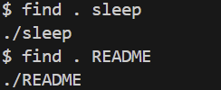
### xargs
#### 实验目的
在 xv6 操作系统中实现一个用户级的 xargs 程序。该程序的功能是从标准输入读取数据，并将读取的数据作为参数传递给指定的命令执行，实现类似 Unix 系统中 xargs 命令的批处理功能。  
通过完成本次实验，旨在深入理解以下几个关键概念：  
- 掌握 fork( ) 和 exec( ) 系统调用的协作使用，理解父子进程的执行流程和生命周期管理。
- 标准输入处理：学会使用 gets( ) 函数从标准输入逐行读取数据，掌握输入缓冲区的管理和行处理技术。
- 动态参数构造：理解如何动态解析和构造命令行参数数组，学会将用户输入与预定义参数合并。
#### 实验原理
- xargs 命令的基本概念  
    xargs 是 Unix 系统中的一个重要工具，它的主要作用是：  
    - 从标准输入读取数据。
    - 将读取的数据作为参数传递给指定的命令。
    - 为每行输入创建一个新的进程执行命令。
    - 等待所有子进程执行完毕。
- exec( ) 系统调用  
    exec 是 Unix/Linux 系统中用于执行新程序的核心系统调用。它的主要功能是将当前进程的内存映像替换为新程序的内存映像，但保持进程 ID 不变。  
    关键特点：
    - 进程ID保持不变。
    - 完全替换进程的内存空间（代码和数据段）。
    - 如果成功执行，永远不会返回到原程序。
    - 只有执行失败时才会返回。
- 核心算法设计  
    xargs 的工作流程可以分为以下几个步骤：  
    - 输入处理：逐行读取标准输入，去除换行符和空白字符。
    - 参数解析：将每行输入按空格分割成独立的参数。
    - 参数合并：将原始命令参数与输入参数合并。
    - 进程执行：创建子进程执行合并后的命令。
    - 同步等待：父进程等待子进程执行完毕。
#### 实验步骤
- 输入验证和初始化
    ```c
    int main(int argc, char *argv[])
    {
        if (argc < 2) {
            printf("Usage: xargs command [args...]\n");
            exit(1);
        }
        
        char line[512];  // 输入缓冲区
    }
    ```
- 主循环：逐行处理输入
    ```c
    while (gets(line, sizeof(line)) != 0) {
        // 去掉行末的换行符
        int len = strlen(line);
        if (len > 0 && line[len-1] == '\n') {
            line[len-1] = '\0';
        }
        
        // 跳过空行
        if (strlen(line) == 0) {
            continue;
        }
        
        // 处理当前行...
    }
    ```
- 参数解析算法
    ```c
    // 解析当前行的参数
    char *line_args[MAXARG];
    int line_argc = 0;

    char *p = line;
    while(*p && line_argc < MAXARG - 1) {
        // 跳过前导空格
        while (*p == ' ' || *p == '\t') {
            p++;
        }
        
        // 如果到了字符串末尾，退出
        if (*p == '\0') {
            break;
        }
        
        // 记录参数开始位置
        line_args[line_argc++] = p;
        
        // 找到参数结束位置
        while (*p && *p != ' ' && *p != '\t') {
            p++;
        }
        
        // 用 '\0' 分隔参数
        if (*p) {
            *p++ = '\0';
        }
    }
    ```
- 参数数组构造
    ```c
    // 构造新的参数数组
    char *new_argv[MAXARG];
    int new_argc = 0;

    // 复制原命令和参数
    for (int i = 1; i < argc && new_argc < MAXARG - 1; i++) {
        new_argv[new_argc++] = argv[i];
    }

    // 添加从标准输入读取的参数
    for (int i = 0; i < line_argc && new_argc < MAXARG - 1; i++) {
        new_argv[new_argc++] = line_args[i];
    }

    // 参数数组必须以 NULL 结尾
    new_argv[new_argc] = 0;
    ```
- 进程创建和命令执行
    ```c
    // 创建子进程执行命令
    if (fork() == 0) {
        // 子进程执行命令
        exec(argv[1], new_argv);
        printf("exec %s failed\n", argv[1]);
        exit(1);
    } else {
        // 父进程等待子进程完成
        wait(0);
    }
    ```
#### 测试结果
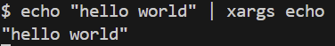
### 实验遇到的问题和解决办法
- 对需要的系统调用不熟悉，不知道使用哪个系统调用实现功能   
  解决办法：阅读实验手册中的相关提示，再阅读源码中系统调用的定义和具体实现，结合大模型了解使用方法。  
- 在使用管道时，对文件描述符符管理不当，导致内存泄露  
  解决办法：分析每个进程对不同管道的需求，关闭不需要的读端或写端，并且在完成功能后，及时关闭使用的读端或写端。
- 不习惯和忘记使用 exit( ) 和 wait( ) 系统调用   
  解决方法：父进程要等待子进程结束，回收其资源，并且使用 exit( ) 确保进程正确终止。
### 实验心得
通过完成本次 xv6 Lab Utilities 实验，我对操作系统的用户空间编程和系统调用有了更深入的理解和实践体验。
- 系统调用理解的深化：  
  通过实现 sleep、pingpong 等程序，我深刻理解了用户态程序如何通过系统调用与内核交互。特别是在分析 sleep 程序时，从用户空间的函数调用到 usys.S 中的汇编存根，再到内核态的 sys_sleep 函数，整个调用链路让我对操作系统的分层架构有了清晰的认识。
- 进程间通信机制的掌握：  
  pingpong 和 primes 实验让我熟练掌握了管道（pipe）这一重要的 IPC 机制。从简单的父子进程双向通信，到复杂的多进程链式协作，我学会了如何正确管理文件描述符，避免资源泄漏。特别是在 primes 实验中，理解了如何通过递归创建进程链来实现分布式的埃拉托斯特尼筛法。
- 文件系统编程技能：  
  find 和 xargs 实验让我深入了解了 xv6 文件系统的结构。通过解析目录项、遍历目录树、构造路径等操作，我掌握了文件系统编程的核心技术。特别是学会了如何正确处理目录项结构体和动态构造文件路径。  
- C 语言编程的精进：  
  在 xv6 这个精简但功能完整的操作系统环境中编程，让我的 C 语言技能得到了显著提升。从命令行参数处理、字符串操作，到内存管理和指针运用，都有了更深的理解。
- 系统编程思维的培养：  
  通过这些实验，我学会了用系统编程的角度思考问题。比如在设计程序时要考虑进程生命周期管理、文件描述符的正确关闭、错误处理机制等。这种思维方式对于编写健壮的系统级程序非常重要。
- 问题解决能力：  
  在实验过程中遇到的文件描述符管理不当、进程同步问题等，通过仔细分析代码逻辑、查阅文档和调试，最终都得到了解决。这个过程不仅提高了我的调试能力，更重要的是培养了面对复杂系统问题时的分析和解决能力。
### 实验得分

## Lab System Calls
### System call tracing
#### 实验目的
本次实验的核心原理是，在 xv6 操作系统中实现一个新的系统调用 trace ，该系统调用可以用来跟踪进程的执行状态，包括记录进程执行过程中的系统调用、进程状态变化等信息。实验要求通过修改操作系统内核，设计并实现用户程序调用 trace 系统调用，进而收集和输出进程的执行轨迹。  
通过完成本次实验，旨在深入理解以下几个关键概念：  
- 系统调用扩展：如何在 xv6 中添加新的系统调用，以及如何在内核中实现其具体功能。
- 进程跟踪与调试：如何使用系统调用进行进程执行的跟踪，记录进程状态、调用信息等。
- 内核与用户态交互：通过用户程序触发系统调用，分析内核如何提供服务以及如何协调内核和用户之间的通信。
- 进程管理与调度：深入理解内核如何管理进程，如何在执行过程中捕获进程的状态变化并进行追踪。
#### 实验原理
本实验的核心原理是：通过系统调用追踪机制，让内核在进程执行系统调用时主动打印出相关信息，以便观察和调试进程的行为。该机制需要在用户态程序发起请求后，由内核在适当位置进行响应与输出。  
- 系统调用流程总览
    1. 用户程序调用包装函数（例如 sleep( )）；
    2. 通过汇编存根（usys.S）将系统调用号放入 a7 寄存器，并触发 ecall 指令；
    3. ecall 导致 CPU 陷入内核态，进入 trap handler ；
    4. 最终跳转到 syscall( ) 函数，由内核执行对应的系统调用处理函数；
    5. 系统调用处理完成后，返回用户态，并将返回值保存在 trapframe 的 a0 寄存器中。  

    trace() 的用户级程序
    ```c
    #include "kernel/param.h"
    #include "kernel/types.h"
    #include "kernel/stat.h"
    #include "user/user.h"

    // 这段代码接收两个参数：trace mask command [args...]
    // mask 是一个整数，用来指示要追踪哪些系统调用。
    // command [args...] 是要运行的命令及其参数。
    int
    main(int argc, char *argv[])
    {
        int i;
        char *nargv[MAXARG];

        // 要求至少三个参数且检查掩码是否以数字开头
        if (argc < 3 || (argv[1][0] < '0' || argv[1][0] > '9')) {
            fprintf(2, "Usage: %s mask command\n", argv[0]);
            exit(1);
        }

        // 调用系统调用 trace() 启用追踪功能：
        if (trace(atoi(argv[1])) < 0) {
            fprintf(2, "%s: trace failed\n", argv[0]);
            exit(1);
        }
            
        // 准备要执行的命令参数：
        for (i = 2; i < argc && i < MAXARG; i++) {
            nargv[i - 2] = argv[i];
        }
        exec(nargv[0], nargv);
        exit(0);
    }
    ```
- trace 系统调用的设计思路  
trace(mask) 系统调用的功能是：允许用户通过一个掩码参数选择要追踪的系统调用集合。掩码是一个整数，每一位代表一个系统调用编号，1 表示追踪，0 表示忽略。例如，trace(1 << SYS_read) 表示只追踪 read 系统调用。  
实现该功能需要以下几个关键部分：
    - 内核为每个进程增加一个字段 trace_mask ，用于保存当前进程要追踪的系统调用集合；
    - 实现 sys_trace 系统调用，用于设置当前进程的 trace_mask ；
    - 在 syscall( ) 函数中，执行完系统调用后，检查当前系统调用是否被追踪：
#### 实验步骤
- 添加用户程序 trace  
  在 Makefile 中的 UPROGS 项添加 trace 用户程序：  
  ```make
  UPROGS=\
    ···
    $U/_trace \
  ```
  运行 make qemu 后无法编译。
  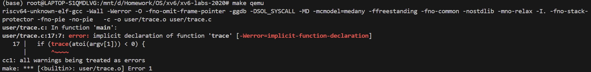
- 注册新的系统调用 trace  
系统调用在用户态和内核之间需要多个注册步骤：  
    1. 定义系统调用号
    在 kernel/syscall.h 中添加：
        ```c
        #define SYS_trace 22
        ```
    2. 添加系统调用函数声明
        在 user/user.h 中添加：
        ```c
        int trace(int mask);
        ```
    3. 添加系统调用 stub
        在 user/usys.pl 中添加：
        ```c
        entry("trace");
        ```
    4. 生成 stub 汇编文件  
        执行 make qemu，自动生成 user/usys.S ，解决用户态程序编译错误。  

    执行指令 trace 32 grep hello README 会失败  
    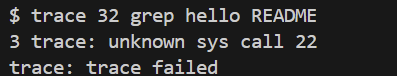
- 实现内核系统调用 sys_trace  
    1. 添加内核接口声明  
    在 kernel/sysproc.c 中添加系统调用实现函数：
        ```c
        uint64
        sys_trace(void)
        {
            int mask;
            // 从用户传入的第 0 个参数中读取一个整数，存到 mask
            if (argint(0, &mask) < 0)
                return -1;
            
            // 把刚刚读取的 mask 保存进这个进程的 trace_mask 字段中
            myproc()->trace_mask = mask;  // 获取当前正在运行的进程结构体
            return 0;
        }
        ```
    2. 在 kernel/proc.h 的 struct proc 中添加字段：
        ```c
        int trace_mask;  // 用于保存追踪的掩码
        ```
- 在内核系统调用表中注册 trace  
在 kernel/syscall.c 中：
    1. 添加 extern 声明：
        ```c
        extern uint64 sys_trace(void);
        ```
    2. 在 syscalls[ ] 表中添加：
        ```c
        [SYS_trace]   sys_trace,
        ```
    3. 添加 syscall_names ：
        ```c
        static char *syscall_names[] = {
            [SYS_fork] = "fork",
            [SYS_exit] = "exit",
            [SYS_wait] = "wait",
            [SYS_pipe] = "pipe",
            [SYS_read] = "read",
            [SYS_kill] = "kill",
            [SYS_exec] = "exec",
            [SYS_fstat] = "fstat",
            [SYS_chdir] = "chdir",
            [SYS_dup] = "dup",
            [SYS_getpid] = "getpid",
            [SYS_sbrk] = "sbrk",
            [SYS_sleep] = "sleep",
            [SYS_uptime] = "uptime",
            [SYS_open] = "open",
            [SYS_write] = "write",
            [SYS_mknod] = "mknod",
            [SYS_unlink] = "unlink",
            [SYS_link] = "link",
            [SYS_mkdir] = "mkdir",
            [SYS_close] = "close",
            [SYS_trace] = "trace",
        };
        ```
- fork 时复制 trace_mask  
在 kernel/proc.c 的 fork( ) 函数中，复制 trace_mask：
    ```c
    np->trace_mask = p->trace_mask;
    ```
- 在 syscall( ) 中打印追踪信息  
修改 syscall( ) 中系统调用处理逻辑：
    ```c
    int num = p->trapframe->a7;
    if(num > 0 && num < NELEM(syscalls) && syscalls[num]) {
        p->trapframe->a0 = syscalls[num]();

        if(p->trace_mask & (1 << num)) {
            printf("%d: syscall %s -> %d\n",
            p->pid,
            syscall_names[num] ? syscall_names[num] : "unknown",
            p->trapframe->a0);
        }
    }
    ```
#### 测试结果
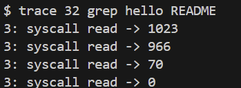
### Sysinfo
#### 实验目的
本实验的目的是实现和测试 sysinfo( ) 系统调用。通过此实验，旨在深入理解以下几个关键概念：  
- 系统调用扩展：如何在 xv6 中添加新的系统调用。
- 内核与用户态交互：如何通过系统调用在用户程序和内核之间传递信息。
- 进程管理与资源统计：如何获取系统的资源状态，例如进程数和空闲内存。
- 内存与数据结构操作：理解内核如何管理进程和内存，并通过合适的数据结构获取这些信息。
#### 实验原理
- sysinfo( ) 系统调用  
sysinfo( ) 系统调用的功能是获取系统的当前状态，包括：  
    - 系统的空闲内存（freemem）；
    - 当前活动的进程数（nproc）。  

    该系统调用将信息保存在一个结构体中，用户通过调用该系统调用获取这些信息。
- 系统调用的执行流程
    1. 用户程序通过调用 sysinfo( ) 请求系统信息；
    2. sysinfo( ) 系统调用通过 argaddr( ) 获取用户提供的地址；
    3. 内核从内存中读取相关信息并填充一个结构体；
    4. 内核通过 copyout( ) 函数将结构体中的数据复制到用户空间；
    5. 用户程序获取并显示返回的信息。
- copyout( ) 函数  
在 xv6 操作系统中，内核态和用户态是分离的，用户进程不能直接访问内核地址空间，内核也不能直接访问用户虚拟地址空间。因此，在内核向用户空间传递数据时，必须使用特殊机制来确保地址合法性与内存隔离性。
    ```c
    int copyout(pagetable_t pagetable, uint64 dstva, char *src, uint64 len);
    ```
    - pagetable：用户进程的页表（虚拟地址映射）
    - dstva：用户空间目标虚拟地址（destination virtual address）
    - src：内核空间的源地址（源数据位于内核）
    - len：要拷贝的字节数
    
    将内核中的一段数据（src）按字节复制到指定用户虚拟地址（dstva），总长度为 len 字节。
- 物理内存分配器  
xv6 中的物理内存分配器负责管理内核可用的物理内存，它将内存划分为固定大小的页（Page），每页为 4096 字节（4KB）。分配器的设计采用了**空闲页链表**方式，来跟踪未使用的物理页。  
    这是表示一个空闲页的结构：
    ```c
    struct run {
    struct run *next;  // 指向下一个空闲页
    };
    ```
- 进程管理  
xv6 使用一个固定大小的进程表数组管理所有进程：
    ```c
    struct proc proc[NPROC];
    ```
    - 每个 proc[i] 表示一个进程；
    - NPROC 是最大进程数（通常为 64）；
    - 调度器和系统调用通过遍历 proc[ ] 实现进程查找、管理和调度。
#### 实验步骤
- 添加用户程序 sysinfotest  
  在 Makefile 中的 UPROGS 项添加 sysinfotest 用户程序：  
  ```make
  UPROGS=\
    ···
    $U/_sysinfotest \
  ```
- 注册新的系统调用 sysinfo  
与 trace 实验相同。  
- 实现内核系统调用 sys_sysinfo  
在 kernel/sysproc.c 中实现 sys_sysinfo( )，该函数用于填充 sysinfo 结构体并返回。
    ```c
    uint64 
    sys_sysinfo(void)
    {
        struct sysinfo info;
        uint64 addr;

        if (argaddr(0, &addr) < 0)  // 获取用户传入的地址参数
            return -1;

        info.freemem = count_free_mem();  // 获取空闲内存字节数
        info.nproc = count_used_proc();   // 获取非UNUSED进程数

        // 将结构体从内核空间拷贝到用户空间
        if (copyout(myproc()->pagetable, addr, (char *)&info, sizeof(info)) < 0)
            return -1;

        return 0;
    }
    ```
- 实现辅助函数
    - count_free_mem( )：统计系统空闲内存。
    ```c
    uint64 
    count_free_mem()
    {
        struct run *r;
        uint64 total = 0;
        acquire(&kmem.lock);  // 上锁，防止数据竞态
        for (r = kmem.freelist; r; r = r->next)  // 遍历空闲页链表
            total += PGSIZE;  // 页表大小
        release(&kmem.lock);
        return total;
    }
    ```
    - count_used_proc( )：统计当前系统中活跃进程数。
    ```c
    uint64 
    count_used_proc()
    {
        struct proc *p;
        int count = 0;
        for (p = proc; p < &proc[NPROC]; p++) {
            if (p->state != UNUSED)
                count++;
        }
        return count;
    }
    ```
- 在内核系统调用表中注册 sysinfo  
与 trace 实验相同。  
#### 测试结果
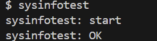
### 实验遇到的问题和解决办法
- 对实现一个系统调用的流程陌生   
刚开始不清楚从定义函数到在用户态调用系统调用需要修改哪些文件，涉及哪些内核机制。阅读官方实验文档，了解系统调用的完整路径：内核函数定义 → 系统调用表注册 → 系统调用号分配 → 用户空间调用接口，对比现有系统调用的实现，模仿其结构来实现自定义调用。
- 对用户态和内核态的交互陌生  
刚开始不理解如何安全地在用户态和内核态之间传递数据，学习 copy_from_user( ) 和 copy_to_user( ) 等内核提供的 API，理解其在访问用户空间数据时的作用，编写简单的测试调用，验证用户态数据在内核中的正确传递，并参考已有系统调用的实现方式，避免直接操作用户指针带来的风险。
- 不清楚系统调用流程的代码实现  
看到了用户态和内核态对系统调用的代码实现，但是不理解从用户态到内核态的转换是怎么用代码实现的。通过查阅相关资料和向大模型提问，了解到：  
在用户态执行时触发系统调用的关键汇编指令，实现了从用户态到内核态的转换：
    ```
    sysinfo:
     li a7, SYS_sysinfo  # 把系统调用号 SYS_sysinfo 放入 a7（系统调用号寄存器）
     ecall               # 执行 ecall 指令，进入内核态
    ```
### 实验心得
- 深入理解系统调用机制  
通过本实验，理解了系统调用作为用户态与内核态的桥梁，其调用流程涉及用户空间发起调用、陷入内核、内核函数执行、结果返回等多个步骤。
- 掌握了内核代码修改流程  
实践了在 Linux 内核中添加一个新系统调用，包括在内核源码中实现函数、更新系统调用表、重新编译内核等步骤，加深了对内核可扩展性的认识。
- 增强了调试与查阅能力  
在实现过程中遇到诸多编译报错与运行问题，通过阅读内核日志、查阅文档及调试分析，逐步解决了问题，提升了定位与解决问题的能力。
- 理解了用户态与内核态数据交互  
学会了使用 copy_from_user( )、copy_to_user( ) 安全地访问用户空间数据，体会到内核开发对内存安全的严格要求。

    本实验不仅让我了解了系统调用的基本实现过程，还提升了对操作系统内核机制的理解。在实践中，理论知识得到了巩固，系统编程能力也有了提高。
### 实验得分

## Lab Page Tables
### 实验目的
本实验旨在深入理解 RISC-V 架构下的页表机制，通过修改 xv6 操作系统的虚拟内存系统，掌握页表的创建、管理和优化技术，提高内核与用户空间之间数据传输的效率。  
通过完成本次实验，旨在深入理解以下几个关键概念：  
- 深入了解页表机制和三级页表的层次结构：
    - 掌握 RISC-V 三级页表的层次结构：理解页目录、页中间目录、页表的三层映射关系。
    - 理解页表项（PTE）格式：掌握物理地址提取、权限位设置和有效位判断。
    - 页表遍历算法：学会如何遍历多级页表完成地址转换。
- 虚拟地址空间管理:
    - 掌握虚拟地址到物理地址转换。
    - 地址空间布局设计：掌握用户空间和内核空间的地址分配策略。
    - 内存映射机制：理解不同类型内存区域（代码段、数据段、栈等）的映射方式。
    - 地址空间限制管理：理解 PLIC 地址限制对用户进程大小的约束。
- 区分进程页表和内核页表：
    - 传统共享内核页表模式：理解 xv6 原有的全局内核页表设计。
    - 进程独立内核页表设计：掌握为每个进程创建独立内核页表的必要性和实现方法。
    - 双页表机制：理解进程同时维护用户页表和内核页表的设计模式。
- 调度器中的页表切换机制：
    - 上下文切换中的页表管理：理解进程切换时如何切换页表上下文
    - 内核栈映射管理：学会为每个进程的内核页表单独映射其内核栈。
### 实验原理
#### 页表机制
页表是操作系统实现虚拟内存的核心数据结构，它建立了虚拟地址与物理地址之间的映射关系。  
当 CPU 访问虚拟地址时，内存管理单元（MMU）自动通过页表将其转换为物理地址，实现地址空间的虚拟化。
####  三级页表结构
RISC-V架构采用三级页表结构来管理 64 位虚拟地址空间，有效减少页表的内存占用。  
地址结构分解：  
```
虚拟地址 (64位): [63:39] [38:30] [29:21] [20:12] [11:0]
                 未使用   L2      L1      L0    页内偏移
```
三级层次结构：  
```
L2页表 (512项)
├── L1页表 (512项)
│   ├── L0页表 (512项)
│   │   ├── 物理页面0
│   │   ├── 物理页面1
│   │   └── ...
│   └── ...
└── ...
```
#### 内核页表和内核地址空间
内核地址空间是操作系统为内核代码和数据预留的虚拟地址范围，通常位于虚拟地址空间的高地址区域。在 xv6 中，内核地址空间从 KERNBASE（0x80000000）开始向上扩展。
```
64 位虚拟地址空间布局：
0x0000000000000000  ┌─────────────────────┐
                    │                     │
                    │   用户地址空间       │  0x0 - 0x0C000000
                    │                     │
0x000000000C000000  ├─────────────────────┤  PLIC (内核设备)
                    │                     │
                    │   保留区域           │
                    │                     │
0x0000000080000000  ├─────────────────────┤  KERNBASE
                    │                     │
                    │   内核地址空间       │  内核代码、数据、设备
                    │                     │
0xFFFFFFFFFFFFFFFF  └─────────────────────┘
```
内核地址空间特点：
- 特权级访问控制：内核代码需要访问特权资源（物理内存管理、设备寄存器操作、中断处理、系统调用处理）
- 直接物理地址映射：内核可以直接通过虚拟地址访问物理内存，提高性能，便于调试。
#### 进程的双页表机制
现代操作系统为每个进程维护两套页表：用户页表和内核页表。  
地址空间分离：  
- 用户页表：映射用户虚拟地址空间（0x0 - 0xC000000）
- 内核页表：映射内核虚拟地址空间（0x80000000以上）+ 用户地址空间副本  

在用户态时，使用用户页表，在进程上下文内核态时，使用内核页表。
#### 为什么进程需要内核页表的副本
- 传统设计  
当内核需要访问用户空间的数据时，因为此时使用的是内核页表，而内核页表中并没有用户地址空间的映射信息，内核无法直接使用用户的虚拟地址。  
为了解决这个问题，传统的做法是在内核中实现软件的地址转换，通过软件模拟页表遍历的过程，手动将用户的虚拟地址转换为物理地址，但性能开销很大。
- 解决方案  
为每个进程创建一个专属的内核页表副本，这个副本不仅包含所有必要的内核地址映射，还包含该进程用户地址空间的完整映射。  
用户页表中，用户地址被标记为用户可访问，这样用户程序可以正常访问自己的地址空间。在内核页表副本中，同样的用户地址被标记为只有内核可访问。  
- 优点  
    - 内核可以利用硬件 MMU 来进行地址转换，而不需要软件模拟，速度更快。
    - 代码简化带来的维护优势。
    - 安全性和隔离性的增强。
### 实验步骤
#### Print a page table
- 在 kernel / defs.h 中添加函数原型
    ```c
    void            vmprint(pagetable_t);
    ```
- 在 kernel / vm.c 中实现 vmprint 函数
    ```c
    // 辅助函数
    void
    vmprint_helper(pagetable_t pagetable, int level)
    {
        // 遍历页表中的所有页表项
        for (int i = 0; i < 512; i++) {
            pte_t pte = pagetable[i];
            // 只打印有效的PTE
            if (pte & PTE_V){
                // 打印缩进
                for (int j = 0; j < level; j++) {
                    printf(".. ");
                }

                // 打印PTE索引、内容和物理地址
                uint64 pa = PTE2PA(pte); // 获取实际物理地址
                printf("..%d: pte %p pa %p\n", i, pte, pa);

                // 如果这个PTE指向下一级页表，递归打印
                // 判断条件：PTE没有R/W/X权限位（说明是页表指针，而非叶子页）
                if ((pte & (PTE_R|PTE_W|PTE_X)) == 0) {
                    // 这是一个页表指针，而不是叶子节点
                    vmprint_helper((pagetable_t)pa, level + 1); // 物理地址作为指针，通过直接映射转化为虚拟地址
                    // 只有在内核态时。内核地址空间可以直接映射
                }
            }
        }
    }

    void
    vmprint(pagetable_t pagetable)
    {
        printf("page table %p\n", pagetable);
        vmprint_helper(pagetable, 0);
    }
    ```
- 在 exec.c 中添加调用
    ```c
    if (p->pid==1)
        vmprint(p->pagetable);
    ```
- 实验结果  
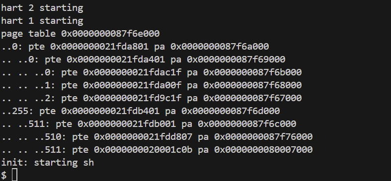
#### A kernel page table per process
- 在 kernel / proc.h 的 struct proc 中添加内核页表字段
    ```c
    pagetable_t pagetable;       // User page table
    pagetable_t kernel_pagetable;  // 每个进程的内核页表
    ```
- 实现创建内核页表副本函数  
    在 kernel / vm.c 中实现
    ```c
    // 为特定页表映射内存，相当于为页表增加一个页表项
    void 
    kvmmap_p(pagetable_t pagetable, uint64 va, uint64 pa, uint64 sz, int perm)
    {
        if (mappages(pagetable, va, sz, pa, perm) != 0)
            panic("kvmmap_p");
    }

    // 为进程创建一个内核页表，用于在内核态时将虚拟地址对物理地址的映射
    pagetable_t
    kvmcreate(void)
    {
        pagetable_t kpagetable;
        
        // 分配一个页表根页
        kpagetable = (pagetable_t) kalloc();
        if (kpagetable == 0)
            return 0;
        memset(kpagetable, 0, PGSIZE);
        
        // 复制全局内核页表中的映射
        // uart registers
        kvmmap_p(kpagetable, UART0, UART0, PGSIZE, PTE_R | PTE_W);
        // virtio mmio disk interface
        kvmmap_p(kpagetable, VIRTIO0, VIRTIO0, PGSIZE, PTE_R | PTE_W);
        // CLINT
        kvmmap_p(kpagetable, CLINT, CLINT, 0x10000, PTE_R | PTE_W);
        // PLIC
        kvmmap_p(kpagetable, PLIC, PLIC, 0x400000, PTE_R | PTE_W);
        // map kernel text executable and read-only.
        kvmmap_p(kpagetable, KERNBASE, KERNBASE, (uint64)etext-KERNBASE, PTE_R | PTE_X);
        // map kernel data and the physical RAM we'll make use of.
        kvmmap_p(kpagetable, (uint64)etext, (uint64)etext, PHYSTOP-(uint64)etext, PTE_R | PTE_W);
        // map the trampoline for trap entry/exit to
        // the highest virtual address in the kernel.
        kvmmap_p(kpagetable, TRAMPOLINE, (uint64)trampoline, PGSIZE, PTE_R | PTE_X);
        
        return kpagetable;
    }
    ```
- 实现内核页表释放函数  
    在 kernel / vm.c 中实现
    ```c
    void
    free_kernel_pagetable(struct proc* p)
    {
        // 全局共享资源，使用参数 0（不释放物理内存）
        uvmunmap(p->kernel_pagetable, UART0, 1, 0);
        uvmunmap(p->kernel_pagetable, VIRTIO0, 1, 0);
        uvmunmap(p->kernel_pagetable, CLINT, 0x10000 / PGSIZE, 0);
        uvmunmap(p->kernel_pagetable, PLIC, 0x400000 / PGSIZE, 0);
        uvmunmap(p->kernel_pagetable, KERNBASE, ((uint64)etext-KERNBASE) / PGSIZE, 0);
        uvmunmap(p->kernel_pagetable, (uint64)etext, (PHYSTOP-(uint64)etext) / PGSIZE, 0);
        uvmunmap(p->kernel_pagetable, TRAMPOLINE, 1, 0);

        // 解除进程专属内核栈映射，并释放其物理内存
        uvmunmap(p->kernel_pagetable, p->kstack, 1, 1);

        // 递归释放所有页表页面
        uvmfree(p->kernel_pagetable, 0);
    }
    ```
- 修改进程初始化  
    - 修改 kernel / proc.c 中的 procinit 函数
        ```c
        void
        procinit(void)
        {
            struct proc *p;
            
            // 将内核初始化代码删除
            initlock(&pid_lock, "nextpid");
            for (p = proc; p < &proc[NPROC]; p++) {
                initlock(&p->lock, "proc");
            }
            
            kvminithart();
        }
        ```
    - 修改 kernel / proc.c 中的 allocproc 函数
        ```c
        ... 其余代码保持不变 ...
        // 创建内核页表副本
        p->kernel_pagetable = kvmcreate();
        if (p->kernel_pagetable == 0) {
            // 释放进程资源
            freeproc(p);
            release(&p->lock);
            return 0;
        }

        // 分配内核栈
        char *pa = kalloc();
        if (pa == 0)
            panic("kalloc");
        uint64 va = KSTACK((int) (p - proc));
        // 将内核栈的虚拟地址映射到物理地址
        kvmmap_p(p->kernel_pagetable, va, (uint64)pa, PGSIZE, PTE_R | PTE_W);
        p->kstack = va;
        ... 其余代码保持不变 ...
        ```
- 修改 kernel / proc.c 中的 scheduler 函数
    ```c
    ... 其余代码保持不变 ...
    p->state = RUNNING;
    c->proc = p;

    // 添加这两行代码：切换到进程的内核页表
    w_satp(MAKE_SATP(p->kernel_pagetable));  // 加载进程的内核页表
    sfence_vma();  // 刷新 TLB

    swtch(&c->context, &p->context);

    // Process is done running for now.
    // It should have changed its p->state before coming back.

    // 切换回全局内核页表
    kvminithart();
    c->proc = 0;

    found = 1;
    ... 其余代码保持不变 ...
    ```
- 修改 kernel / proc.c 中的 freeproc 函数
    ```c
    if (p->trapframe)
        kfree((void*)p->trapframe);
    p->trapframe = 0;

    if (p->pagetable)
        proc_freepagetable(p->pagetable, p->sz);
    p->pagetable = 0;
    // 新增释放内核页表
    if (p->kernel_pagetable) {
        free_kernel_pagetable(p);
        p->kernel_pagetable = 0;
    }
    ... 其余代码保持不变 ...
    ```
- 修改 kernel / vm.c 中的 kvmpa 函数以支持进程内核页表
    ```c
    uint64 
    kvmpa(uint64 va)
    {
        struct proc *p = myproc();
        uint64 off = va % PGSIZE;
        pte_t *pte;
        uint64 pa;

        pte = walk(p->kernel_pagetable, va, 0);
        if (pte == 0)
            panic("kvmpa");
        if ((*pte & PTE_V) == 0)
            panic("kvmpa");
        pa = PTE2PA(*pte);
        return pa+off;
    }
    ```
- 在 kernel / defs.h 中添加函数原型
    ```c
    pagetable_t     kvmcreate(void);
    void            kvmmap_p(pagetable_t, uint64, uint64, uint64, int);
    void            free_kernel_pagetable(struct proc* p);
    ```
- 实验结果  
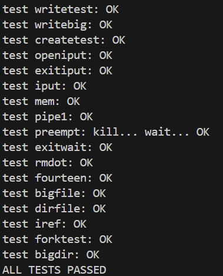
#### Simplify copyin / copyinstr
- 替换 copyin 函数
    ```c
    int
    copyin(pagetable_t pagetable, char *dst, uint64 srcva, uint64 len)
    {
        return copyin_new(pagetable, dst, srcva, len);
    }

    int
    copyinstr(pagetable_t pagetable, char *dst, uint64 srcva, uint64 max)
    {
        return copyinstr_new(pagetable, dst, srcva, max);
    }
    ```
- 将用户页表映射到内核页表
    ```c
    int
    kvmmap_user(pagetable_t kpagetable, pagetable_t upagetable, uint64 va, uint64 sz)
    {
        // kpagetable：内核页表
        // upagetable：用户进程的页表

        // 遍历用户页表，找到物理页映射
        // 然后将相同的物理页映射到内核页表中，但使用相同的虚拟地址
        
        uint64 i, pa;
        pte_t *pte;
        uint flags;
        
        // 将起始地址向下对齐到页边界
        // 循环遍历进程的虚拟内存页面
        for (i = PGROUNDUP(va); i < va + sz; i += PGSIZE) {
            // 查找虚拟地址 i 对应的页表项
            if ((pte = walk(upagetable, i, 0)) == 0)
                panic("kvmmapuser: pte should exist");
            if ((*pte & PTE_V) == 0)
                panic("kvmmapuser: page not present");
            
            // 获取页表项中的物理地址
            pa = PTE2PA(*pte);
            // 从原用户页表项中去除用户权限标志，使得该映射具有内核权限
            flags = PTE_FLAGS(*pte) & (~PTE_U);
            
            // 只需要获取页面的物理地址即可，业内的页表项通过偏移量获取
            // 在内核页表中进行映射
            if (mappages(kpagetable, i, PGSIZE, (uint64)pa, flags) != 0)
                goto err;
        }

        return 0;

        err:
            uvmunmap(kpagetable, PGROUNDUP(va), (i - PGROUNDUP(va)) / PGSIZE, 0);
            return -1;
    }
    ```
- 实现辅助函数，在进程缩小内存时，释放用户虚拟内存空间
    ```c
    void
    kuvmdealloc(pagetable_t pagetable, uint64 oldsz, uint64 newsz, int do_free)
    {
        if (newsz >= oldsz)
            return;

        if (PGROUNDUP(newsz) < PGROUNDUP(oldsz)) {
            int npages = (PGROUNDUP(oldsz) - PGROUNDUP(newsz)) / PGSIZE;
            uvmunmap(pagetable, PGROUNDUP(newsz), npages, do_free);
        }
    }
    ```
- 注释掉 CLINT 映射
    ```c
    // 避免地址冲突 - 确保用户地址空间不与关键内核设备重叠
    // kvmmap_p(kpagetable, CLINT, CLINT, 0x10000, PTE_R | PTE_W);

    // uvmunmap(p->kernel_pagetable, CLINT, 0x10000 / PGSIZE, 0);
    ```
- 调用映射用户页表函数
    - exec( )
        ```c
        ... 其余代码保持不变 ...
        proc_freepagetable(oldpagetable, oldsz);

        // 清除内核页表中对用户态页表的旧映射 
        uvmunmap(p->kernel_pagetable, 0, PGROUNDUP(oldsz)/PGSIZE, 0);
        // 在替换原用户页表之后，将新用户页表塞进内核页表中
        if (kvmmap_user(p->kernel_pagetable, p->pagetable, 0, p->sz) < 0) 
            goto bad;

        if (p->pid==1)
            vmprint(p->pagetable);
        ... 其余代码保持不变 ...
        ```
    - fork( )
        ```c
        ... 其余代码保持不变 ...
        // Copy user memory from parent to child.
        if (uvmcopy(p->pagetable, np->pagetable, p->sz) < 0) {
            freeproc(np);
            release(&np->lock);
            return -1;
        }
        np->sz = p->sz;

        // 添加：将子进程的用户页表映射复制到其内核页表
        if (kvmmap_user(np->kernel_pagetable, np->pagetable, 0, np->sz) < 0) {
            freeproc(np);
            release(&np->lock);
            return -1;
        }

        np->parent = p;
        ... 其余代码保持不变 ...
        ```
    - growproc( )
        ```c
        int
        growproc(int n)
        {
            // 动态调整进程的内存大小
            uint sz;
            struct proc *p = myproc();

            sz = p->sz;

            // 检查 PLIC 限制
            if (PGROUNDUP(sz + n) >= PLIC)
                return -1;

            if (n > 0) {
                if ((sz = uvmalloc(p->pagetable, sz, sz + n)) == 0) 
                    return -1;

                // 添加新映射到内核页表
                if (kvmmap_user(p->kernel_pagetable, p->pagetable, p->sz, n) < 0)
                    return -1;
            } else if (n < 0) {
                sz = uvmdealloc(p->pagetable, sz, sz + n);
                // 从内核页表移除映射
                kuvmdealloc(p->kernel_pagetable, p->sz, p->sz + n, 0);
            }
            p->sz = sz;
            return 0;
        }
        ```
    - userinit( )
        ```c
        ... 其余代码保持不变 ...
        uvminit(p->pagetable, initcode, sizeof(initcode));
        p->sz = PGSIZE;

        // 添加：将用户页表映射复制到内核页表
        if (kvmmap_user(p->kernel_pagetable, p->pagetable, 0, p->sz)<0)
            panic("userinit: kvmmap_user failed");
        ... 其余代码保持不变 ...
        ```
- 在 kernel / defs.h 中添加函数原型
- 实验结果  
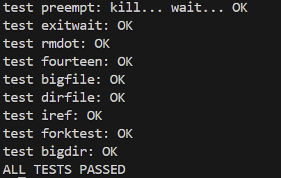
### 实验遇到的问题和解决办法
- 对页面、页表、页表项等概念生疏  
通过复习课内资料和观看 Mit 课程回顾知识点。    
- 不理解实验一中进程和页表的关系，对进程的知识点和内存的知识点串联度不足    
通过深入思考，分析出程序使用虚拟地址，需要将虚拟地址转化为物理地址，因此进程需要通过页表将分配的地址进行转化。
- 不理解实验二和实验三的实验目的    
通过 Mit 课程，学习了内核地址空间的概念，理解了内核页表和用户页表的区别以及只有一张全局内核页表的缺陷。
- 实验二中内存回收失败    
结果测试时，内存页全部回收失败。在实验指导中，提示释放进程资源时，只需要释放页表但不释放物理内存。
这个提示不够清晰，导致我没有回收内核栈的物理内存，但这个提示指的是进程内核页表中映射的全局共享资源（如内核代码、设备寄存器等）的物理内存不能释放，因为这些资源被所有进程共享，但是每个进程的内核页表申请的进程专属内核栈必须释放，否则会导致内存泄漏。
### 实验心得
- 深入理解页表机制的复杂性与精妙性  
通过本次实验，我对页表机制有了从理论到实践的全面认识。之前对页表的理解仅停留在“虚拟地址到物理地址转换”这个概念层面，但在实际实现 vmprint 函数时，我才真正体会到三级页表结构的精妙设计。每一级页表都承担着不同的职责，通过递归遍历的方式，我深刻感受到了分层设计在减少内存占用方面的巨大优势。特别是在调试过程中，看到页表项中物理地址的提取和权限位的设置，让我对硬件与软件协作的细节有了更直观的认识。  
- 双页表设计思想的深刻启发  
实验二中实现进程独立内核页表的过程，让我深刻理解了现代操作系统设计中“用复杂性换取性能”的核心思想。起初我很困惑为什么需要为每个进程维护单独的内核页表，这似乎增加了系统的复杂性。但在实现 copyin / copyinstr 的优化后，我彻底理解了这种设计的价值：通过让硬件 MMU 自动完成地址转换，不仅消除了软件模拟的巨大开销，还简化了系统调用的实现逻辑。这种“一次投入，长期受益”的设计理念，让我对系统优化有了全新的认识。
- 内存管理的精细化控制  
在实现 free_kernel_pagetable 函数时，我遇到了最大的技术难点：如何正确区分全局共享资源和进程私有资源。最初我简单地释放所有映射的物理内存，导致系统崩溃。通过深入分析内存布局和仔细阅读提示，我意识到内核代码、设备寄存器等全局资源不能被释放，而进程的内核栈则必须释放。这个过程让我对操作系统中资源管理的复杂性有了深刻认识，也让我明白了内存泄漏和野指针问题在系统编程中的严重性。
- 页表同步的一致性挑战  
在实现用户页表到内核页表的映射同步时，我深刻体会到了并发和一致性的重要性。每当用户地址空间发生变化（exec、fork、growproc），都必须及时更新内核页表中的对应映射。这种同步机制的实现让我理解了操作系统中状态一致性维护的复杂性，也让我对事务性操作有了更深的理解。
### 实验得分

## Lab Traps
### 实验目的
本实验旨在深入理解 RISC-V 架构下的系统调用机制和中断处理流程，通过分析汇编代码、实现调试工具和构建信号处理机制，掌握操作系统底层的关键技术原理，提高系统编程和内核开发能力。  
通过完成本次实验，旨在深入理解以下几个关键概念：  
- 深入了解 RISC-V 汇编语言和函数调用约定：
    - 掌握 RISC-V 寄存器约定：理解参数寄存器( a0 - a7 )、返回值寄存器、返回地址寄存器( ra )的使用规则。
    - 理解函数调用机制：掌握 jal / jalr 指令的工作原理和栈帧的建立过程。
    - 分析编译器优化：学会识别函数内联优化对汇编代码结构的影响。
    - 字节序处理机制：理解 little - endian 字节序对数据存储和访问的影响。
- 栈帧结构和内存布局管理：
    - 掌握栈帧组织结构：理解 frame pointer( s0 )、return address、局部变量在栈中的布局关系。
    - 栈遍历算法实现：学会通过 frame pointer 链表遍历函数调用栈。
    - 内存边界检测：掌握内核栈的页对齐分配和边界检查机制。
- 中断处理机制：
    - 时钟中断处理：理解硬件时钟中断的产生、捕获和处理流程。
    - 中断上下文管理：掌握 trapframe 结构体在保存和恢复 CPU 状态中的作用。
    - 执行流劫持技术：学会通过修改程序计数器( epc )实现程序执行流的重定向。
- 进程状态保存与恢复机制：
    - 完整状态快照：掌握如何保存和恢复进程的完整 CPU 寄存器状态。
    - 重入保护策略：理解防止信号处理函数嵌套调用的必要性和实现方法。
    - 状态一致性保证：学会确保异步处理不影响原程序执行的正确性。
    - 双向状态切换：掌握从正常执行到信号处理，再回到原执行点的完整流程。
### 实验原理
#### RISC-V 汇编约定原理
标准的寄存器使用约定：
```
参数寄存器: a0 - a7 (x10 - x17) - 前8个函数参数
返回值寄存器: a0 - a1 (x10 - x11) - 函数返回值  
返回地址寄存器: ra (x1) - 存储函数返回地址
栈指针: sp (x2) - 指向当前栈顶
帧指针: s0 / fp (x8) - 指向当前栈帧基址
```
函数调用机制：
```
# 函数调用过程
jal ra, function_name    # 跳转到函数，ra = PC + 4
# 或
jalr ra, 0(register)     # 通过寄存器间接跳转

# 函数返回
jr ra                    # 跳转回调用点
```
#### 栈帧和帧指针
栈帧（Stack Frame）是程序运行时在栈上为每个函数调用分配的内存区域。当函数被调用时，系统会在栈上创建一个新的栈帧来存储该函数的局部变量、参数、返回地址等信息。  
- 栈帧布局：
    ```
    高地址
    +------------------+
    |   局部变量       |
    |   保存的寄存器   |
    +------------------+ <- fp (帧指针，指向当前栈帧基址)
    |   返回地址(ra)   | <- fp - 8
    +------------------+
    |   前一帧指针     | <- fp - 16  
    +------------------+
    |   其他数据       |
    +------------------+ <- sp (栈指针，指向栈顶)
    低地址
    ```
- 关键寄存器：  
    - sp ( Stack Pointer )：栈指针寄存器，指向当前栈顶
    - fp ( Frame Pointer )：帧指针寄存器（在 RISC-V 中对应 s0 寄存器）
    - ra ( Return Address )：返回地址寄存器  

帧指针（Frame Pointer，fp）是指向当前栈帧基址的寄存器，它提供了一个固定的参考点，使得函数可以通过固定的偏移量访问栈帧中的数据。  
#### Trap 机制原理
在 RISC-V 架构中，Trap 是处理器从用户态切换到内核态的机制，主要包括两种类型：  
- 异常
    - 系统调用：用户程序主动请求内核服务
    - 页面错误：访问无效或无权限的内存地址
    - 非法指令：执行无效的指令
    - 除零错误：算术运算异常
- 中断
    - 时钟中断：定时器触发的中断
    - 设备中断：外部设备产生的中断
    - 软件中断：软件触发的中断  

当 trap 发生的瞬间，RISC-V 处理器硬件自动完成保存关键状态信息并切换到内核态。
```c
// 硬件自动保存到CSR寄存器
sepc = pc;                    // 保存当前程序计数器到sepc
scause = trap_cause;          // 保存trap原因到scause  
stval = additional_info;      // 保存附加信息到stval
sstatus.SPIE = sstatus.SIE;   // 保存当前中断使能状态
sstatus.SIE = 0;              // 禁用中断
sstatus.SPP = current_mode;   // 保存当前特权模式
```
```c
// 硬件自动执行的特权级切换
current_mode = SUPERVISOR;    // 切换到Supervisor模式
pc = stvec;                   // 跳转到trap处理程序入口
```
硬件跳转到 stvec 指向的地址后，开始执行软件 trap 处理程序，立即保存寄存器并切换到内核栈。  
接着内核执行 usertrap( ) 函数处理 trap ，过程中由 struct trapframe *trapframe 保存寄存器状态，最后执行 usertrapret( ) 函数返回用户态。
### 实验步骤
#### RISC-V assembly
阅读 user/call.asm 中的 main( )、f( )、g( ) 函数并回答问题。
```
1. Which registers contain arguments to functions? For example, which register holds 13 in main's call to printf?  

a0-a7  
a2

2. Where is the call to function f in the assembly code for main? Where is the call to g? (Hint: the compiler may inline functions.)

根据汇编代码：
  26:	45b1                	li	a1,12
在 main 的汇编代码中没有对函数 f 和 g 的调用，编译器将这些函数内联了。

3. At what address is the function printf located?

根据汇编代码：
  30:	00000097          	auipc	ra,0x0
  34:	600080e7          	jalr	1536(ra) # 630 <printf>
ra = 立即数的高20位 + PC
printf 地址 = ra + 1536
          = 0x30 + 1536
          = 0x30 + 0x600
          = 0x630

4. What value is in the register ra just after the jalr to printf in main?

返回地址 = PC + 4 = 0x34 + 4 = 0x38

5. Run the following code.

	unsigned int i = 0x00646c72;
	printf("H%x Wo%s", 57616, &i);
      
What is the output? Here's an ASCII table that maps bytes to characters.
The output depends on that fact that the RISC-V is little-endian. If the RISC-V were instead big-endian what would you set i to in order to yield the same output? Would you need to change 57616 to a different value?

He110 World
i = 0x726c6400 
57616 不需要改变

6. In the following code, what is going to be printed after 'y='? (note: the answer is not a specific value.) Why does this happen?   
	
    printf("x=%d y=%d", 3);

y= 后面会打印一个未定义的值。
```
#### Backtrace
- 在 kernel / defs.h 中添加函数原型
    ```c
    void            backtrace(void);
    ```
- 在 kernel / riscv.h 中添加读取帧指针的函数
    ```c
    static inline uint64
    r_fp()
    {
        uint64 x;
        asm volatile("mv %0, s0" : "=r" (x) );
        return x;
    }
    ```
- 在 kernel / printf.c 中实现 backtrace( ) 函数
    ```c
    void 
    backtrace(void)
    {
        printf("backtrace:\n");

        // 获取当前帧指针
        uint64 fp = r_fp();

        // 栈空间只有一页，计算栈的边界
        uint64 stack_top = PGROUNDUP(fp);
        uint64 stack_bottom = PGROUNDDOWN(fp);

        while (fp >= stack_bottom && fp < stack_top) {
            // 读取返回地址 (fp - 8)
            uint64 return_addr = *(uint64*)(fp - 8);
            printf("%p\n", return_addr);

            // 获取调用者的帧指针 (fp - 16)
            uint64 prev_fp = *(uint64*)(fp - 16);

            // 检查是否到达栈底
            if (prev_fp == 0 || prev_fp == fp) {
                break;
            }
            
            // 帧指针指向调用者的栈帧
            fp = prev_fp;
        }
    }
    ```
- 在 kernel / sysproc.c 中的 sys_sleep( ) 函数调用 backtrace( ) 函数
    ```c
    int n;
    uint ticks0;

    backtrace(); // 添加调试函数
    ... 其余代码保持不变 ...
    ```
- 实验结果  
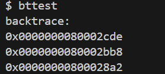
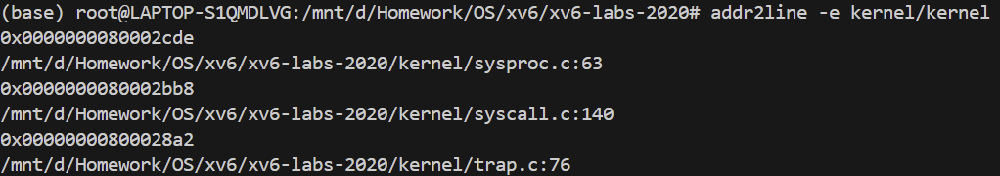
#### Alarm
- 基础设置和编译配置
    - 在 Makefile 的 UPROGS 部分添加 alarmtest
        ```make
        $U/_alarmtest\
        ```
    - 在 user / user.h 中添加系统调用声明
        ```c
        int sigalarm(int ticks, void (*handler)());
        int sigreturn(void);
        ```
    - 在 user / usys.pl 中添加：
        ```c
        entry("sigalarm");
        entry("sigreturn");
        ```
- 内核系统调用框架
    - 在 kernel / syscall.h 中添加：
        ```c
        #define SYS_sigalarm 22
        #define SYS_sigreturn 23
        ```
    - 在 kernel / syscall.c 中：
        ```c
        // 添加函数声明
        extern uint64 sys_sigalarm(void);
        extern uint64 sys_sigreturn(void);

        // 在syscalls数组中添加
        static uint64 (*syscalls[])(void) = {
        // ... 其他系统调用
        [SYS_sigalarm] sys_sigalarm,
        [SYS_sigreturn] sys_sigreturn,
        };
        ```
- 在 struct proc 中添加新字段
    ```c
    // Alarm相关字段
    int alarm_interval;          // 警报间隔（ticks）
    void (*alarm_handler)();     // 警报处理函数指针
    int alarm_ticks;            // 距离下次警报的tick数
    int alarm_gooff;            // 标记是否正在处理警报（重入保护）
    struct trapframe alarm_trapframe; // 保存中断时的寄存器状态
    ```
- 在 kernel / proc.c 的 allocproc( ) 函数中初始化
    ```c
    // ... 现有初始化代码
    
    // 初始化alarm字段
    p->alarm_interval = 0;
    p->alarm_handler = 0;
    p->alarm_ticks = 0;
    p->alarm_gooff = 0;

    return p;
    ```
- 在 kernel / sysproc.c 中实现 alarm 函数
    ```c
    uint64
    sys_sigalarm(void)
    {
        int interval; // 警报间隔
        uint64 handler; // 警报处理函数指针
        
        // 获取参数
        if (argint(0, &interval) < 0)
            return -1;
        if (argaddr(1, &handler) < 0)
            return -1;

        struct proc *p = myproc();
        p->alarm_interval = interval;
        p->alarm_handler = (void(*)())handler;
        p->alarm_ticks = interval;

        return 0;
    }

    uint64
    sys_sigreturn(void)
    {
        struct proc *p = myproc();
        
        // 恢复保存的寄存器状态
        *p->trapframe = p->alarm_trapframe;
        
        // 清除重入保护标记
        p->alarm_gooff = 0;

        return 0;
    }
    ```
- 修改 kernel / trap.c 的 usertrap( ) 函数
    ```c
    // ok
    // 计时器中断
    if (which_dev == 2) {
        // 检查是否设置了警报且未在处理中
        if (p->alarm_interval > 0 && p->alarm_gooff == 0) {
            p->alarm_ticks--;

            // 时间到了，触发警报
            if (p->alarm_ticks <= 0) {
                // 重置计数器
                p->alarm_ticks = p->alarm_interval; 

                // 保存当前状态
                p->alarm_trapframe = *p->trapframe;
                
                // 设置重入保护标记
                p->alarm_gooff = 1;
                
                // 修改返回地址到警报处理函数，跳转到 alarm 函数
                p->trapframe->epc = (uint64)p->alarm_handler;
            }
        }
    }
    ```
- 实验结果  
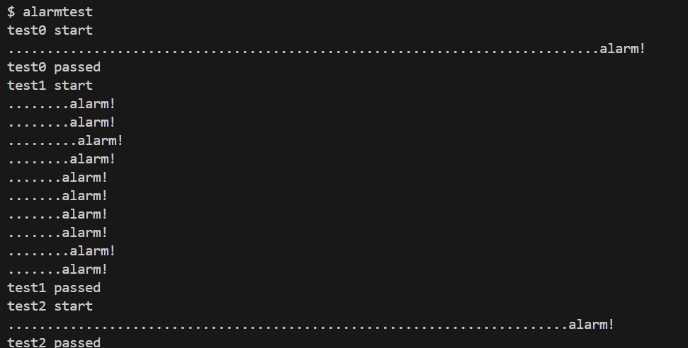
### 实验遇到的问题和解决办法
- 阅读部分汇编指令困难。  
通过查阅实验手册了解指令全称，进而理解指令。  
- 对栈帧结构陌生，不了解栈帧是怎么形成返回地址链的。  
通过观看 Mit 课程，学习了栈帧的具体内部结构，深化了对栈的理解。
### 实验心得
- 对操作系统设计的新认识  
这次实验让我对操作系统的几个核心概念有了更深的理解：  
    - 特权级切换的代价与必要性：每次 trap 都涉及大量的状态保存和恢复工作，这让我理解了为什么系统调用的开销相对较大，也明白了微内核与宏内核设计权衡的深层原因。
    - 异步处理的复杂性：信号处理机制看似简单，但要保证正确性需要考虑重入、状态一致性、时机控制等多个方面，这让我对异步编程有了更深的理解。
    - 硬件与软件的协同：RISC-V 硬件自动保存部分状态到 CSR 寄存器，软件负责保存通用寄存器到 trapframe ，这种分工合作的设计体现了系统设计的智慧。
- 对中断处理机制的深度理解  
Alarm 实验是整个 Lab 中最具挑战性的部分。通过实现信号处理机制，我对 trap 处理有了全新的认识：  
    - 状态保存与恢复的重要性：我学会了为什么需要 alarm_trapframe 来保存完整的CPU状态，以及 alarm_gooff 重入保护标志的必要性。没有这些保护机制，嵌套的信号处理会导致状态混乱。
    - 执行流控制的精妙之处：通过修改 trapframe -> epc 来重定向程序执行流，这种“劫持”技术让我惊叹于操作系统设计的巧妙。程序在时钟中断后“自然地”跳转到 alarm_handler 执行，用户程序对此毫无感知。  
    - 时钟中断的全流程理解：从硬件时钟触发中断，到 trap 处理函数检查计数器，再到修改返回地址，最后通过 sigreturn 恢复原始状态，整个流程让我对中断驱动的操作系统有了更深层的理解。
### 实验得分

## Lab xv6 lazy page allocation
### 实验目的
本实验的主要目的是通过在 xv6 操作系统中实现“懒惰页面分配”技术，理解并掌握现代操作系统中的内存管理机制。通过本实验，将完成以下几个具体目标：  
- 理解 sbrk() 系统调用：  
深入理解 sbrk() 系统调用如何扩展用户进程的堆内存，并分析在没有懒惰分配时如何为新分配的内存页分配物理内存。
- 实现懒惰内存分配：  
通过修改 xv6 内核，实现懒惰分配功能，即让 sbrk() 不立即分配物理内存，而只是记录分配的虚拟内存地址，直到该内存页第一次被访问时，才由操作系统分配和映射物理内存。
- 处理页面故障：  
修改 trap.c 文件中的用户态页面故障处理程序，响应页面缺失，通过分配物理内存并更新页表来处理缺失的页面。实验需要实现懒惰内存分配的核心部分，确保当进程访问懒惰分配的内存页时，能够正确触发并处理页面故障。
- 内存分配的优化：  
通过懒惰分配，体会如何优化内存分配，减少不必要的内存分配操作，提高系统性能，尤其在程序需要大量内存但并不一定使用的情况下。
- 内存错误和异常处理：
处理一些常见的内存错误和异常，如负数的 sbrk() 参数、超出分配范围的地址访问、内存不足等，保证系统的健壮性。
### 实验原理
#### xv6 中进程的内存结构  
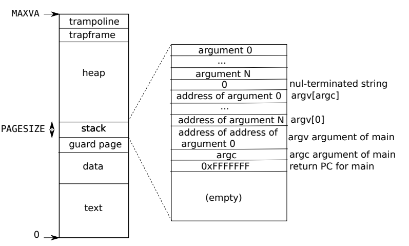  
从低地址到高地址依次是代码段、数据段、保护页、栈、堆。  
栈向低地址增长，为了防止栈溢出，设置保护页，系统能够在栈溢出时及时捕获并处理异常，通常会终止进程，避免它影响到其他进程或系统。   
堆是一个动态增长的内存区域，通过 malloc 等系统调用向堆中申请内存，向高地址增长，无法访问超出已分配的内存区域。  
#### 懒惰分配
在传统方式下，当用户进程调用 sbrk(n) 扩展堆时，内核会立刻为新增的每个页面分配物理内存，并建立虚拟地址和物理地址的映射。  
这种方式有两个问题：  
- 对于一次性申请大量内存的情况（例如申请 1GB），内核必须立即分配大量物理页，耗时很长。
- 进程未必真的会使用申请的所有内存，导致浪费。  

懒惰分配的思想是：  
- 当 sbrk(n) 被调用时，内核只增加进程的 sz（虚拟地址空间大小），但不立即分配物理内存。
- 如果进程尝试访问这些尚未分配物理内存的虚拟地址，CPU 会触发 页面错误。
- 内核在页面错误处理程序中分配一个新的物理页，将其清零，并建立虚拟地址到物理地址的映射。  

这样做的好处：  
- sbrk( ) 调用速度更快，因为不需要立即分配物理页。
- 节省内存：只在真正使用时才分配物理页，适合实现稀疏数组、大规模预分配等场景。
- 提升性能：减少不必要的内存分配和初始化工作。
### 实验步骤
#### Eliminate allocation from sbrk( ) 
- 修改 sysproc.c / sys_sbrk( )
    ```c
    uint64
    sys_sbrk(void)
    {
        int addr;
        int n;

        if (argint(0, &n) < 0)
            return -1;
        addr = myproc()->sz;
        myproc()->sz += n; // 只增加虚拟地址空间大小，不进行内存分配
        return addr;
    }
    ```
- 编译后执行 echo hi 命令  
触发缺页中断：  
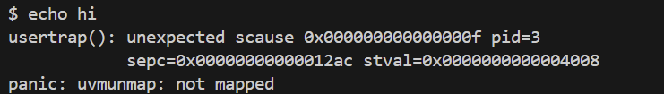
#### Lazy allocation
- 修改 trap.c / usertrap( )
    ```c
    else if (r_scause() == 13 || r_scause() == 15) {
        // 13 is read page fault, 15 is write page fault
        // RISC-V 架构中的一个特殊寄存器，用于存储导致页错误或其他异常的虚拟地址。
        uint64 va = r_stval();

        if (va >= p->sz) {
            // 访问地址超过内存大小
            p->killed = 1;
        } else {
            va = PGROUNDDOWN(va);
            char *mem = kalloc(); // 分配物理页
            if (mem == 0) {
                p->killed = 1;
            } else {
                memset(mem, 0, PGSIZE);
                if (mappages(p->pagetable, va, PGSIZE, (uint64)mem, PTE_W|PTE_R|PTE_X|PTE_U) != 0) {
                    kfree(mem);
                    p->killed = 1;
                }
            }
        }
    }
    ```
- 修改 vm.c / uvmunmap 函数
    ```c
    if ((pte = walk(pagetable, a, 0)) == 0)
        // panic("uvmunmap: walk");
        continue;
    if ((*pte & PTE_V) == 0)
        // panic("uvmunmap: not mapped");
        continue;
    ```
- 实验结果  

#### Lazytests and Usertests
- 修改  sysproc.c / sys_sbrk( ) 处理负数情况
    ```c
    uint64
    sys_sbrk(void)
    {
        int addr;
        int n;
        struct proc *p = myproc();

        if (argint(0, &n) < 0)
            return -1;
        addr = myproc()->sz;

        // 处理负的 sbrk 参数（立即释放内存）
        if (n < 0) {
            if(growproc(n) < 0){
                return -1;
            }
        } else {
            // 仅增加虚拟地址空间大小，不分配物理内存
            p->sz += n;
        }
        
        return addr;
    }
    ```
- 修改 trap.c / usertrap( ) 处理非法地址
    ```c
    uint64 va = r_stval();

    if (va >= p->sz  || va <= PGROUNDDOWN(p->trapframe->sp)) {
        // 超出堆区范围或栈溢出
        p->killed = 1;
    } else {
        va = PGROUNDDOWN(va);
        char *mem = kalloc(); // 分配物理页
        if (mem == 0) {
            p->killed = 1;
        } else {
            memset(mem, 0, PGSIZE);
            if (mappages(p->pagetable, va, PGSIZE, (uint64)mem, PTE_W|PTE_R|PTE_X|PTE_U) != 0) {
                kfree(mem);
                p->killed = 1;
            }
        }
    }
    ```
- 修改 vm.c / uvmcopy( ) 函数正确处理 fork( )
    ```c
    if ((pte = walk(old, i, 0)) == 0)
        // panic("uvmcopy: pte should exist");
        continue;
    if ((*pte & PTE_V) == 0)
        // panic("uvmcopy: page not present");
        continue;
    ```
- 修改 vm.c / walkaddr 函数，处理 copyin、copyout 等函数使用有效地址，但并未分配物理地址的情况
    ```c
    uint64
    walkaddr(pagetable_t pagetable, uint64 va)
    {
        pte_t *pte;
        uint64 pa;
        struct proc *p = myproc();

        if (va >= MAXVA)
            return 0;

        pte = walk(pagetable, va, 0);
        if (pte == 0 || (*pte & PTE_V) == 0) {
            // 检查地址是否在合法范围内
            if (va >= p->sz || va < PGROUNDDOWN(p->trapframe->sp)) 
                return 0;  // 非法地址
            
            // 分配物理内存
            char *mem = kalloc();
            if (mem == 0) {
                p->killed = 1;  // 内存不足，杀死进程
                return 0;
            }
            memset(mem, 0, PGSIZE);
            
            // 映射到页表
            uint64 va_aligned = PGROUNDDOWN(va);
            if (mappages(pagetable, va_aligned, PGSIZE, (uint64)mem, PTE_W|PTE_R|PTE_U) != 0) {
                kfree(mem);
                p->killed = 1;  // 映射失败，杀死进程
                return 0;
            }
        }
        
        if((*pte & PTE_U) == 0)
            return 0;
        pa = PTE2PA(*pte);
        return pa;
    }
    ```
- 实验结果  
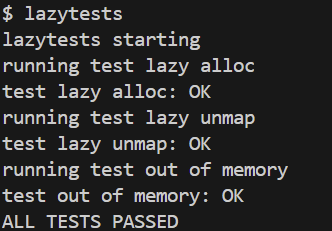  
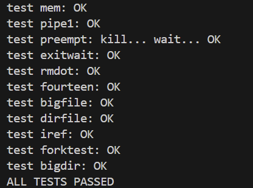
### 实验遇到的问题和解决办法
- 进程的内存空间理解错误
初次做实验时，我向大模型提问：xv6 中进程的内存结构是怎样的？  
大模型回答堆区在低地址，栈区在高地址。  
这就导致代码中`va >= p->sz  || va <= PGROUNDDOWN(p->trapframe->sp)`有逻辑错误：`va <= PGROUNDDOWN(p->trapframe->sp)`是永真的，这令我非常疑惑。  
通过查阅 xv6 book ，我得知了在 xv6 中进程真正的内存结构：栈区在低地址，堆区在高地址，代码中的逻辑判断是合理的。
### 实验心得
通过本次 xv6 懒惰页面分配实验，我对操作系统中虚拟内存管理机制有了更加深入的理解。实验的过程不仅仅是实现代码，更重要的是体会到操作系统设计背后的思想。  
- 对进程的内存结构有了更清晰的认识    
起初我误以为堆在低地址、栈在高地址，导致逻辑判断出现错误。通过查阅《xv6 book》，我纠正了这个概念，明确了 xv6 中的布局是栈位于低地址并向低地址生长，堆位于高地址并向高地址扩展。这个细节让我体会到，理解正确的内存模型对于实现内核功能至关重要。
- 理解懒惰分配的优势  
传统方式在 sbrk( ) 时立刻分配物理内存，虽然简单，但会带来性能开销和内存浪费。通过懒惰分配，内核只在进程第一次访问该页时才实际分配物理页，这样避免了无效的资源消耗。例如在分配大块内存但只使用其中少部分的场景下，懒惰分配能显著提高效率。这种“按需分配”的思想在现代操作系统中被广泛应用，如 Linux 的 demand paging ，让我感受到 xv6 实验与现实系统之间的联系。  
- 深入理解 trap 机制  
在缺页异常 (page fault) 的处理中，我学会了如何在 trap 机制下捕获并正确响应异常。通过在 trap.c 中添加逻辑，能够在访问未分配的虚拟地址时自动分配物理页并更新页表。这让我理解了操作系统是如何“透明”地支持进程执行的：用户程序并不知道物理内存何时被真正分配，但却能顺畅运行。
- 学会提高代码健壮性  
此外，实验过程中也让我体会到 健壮性的重要性。例如在处理负数 sbrk( ) 参数、非法地址访问、内存不足等情况时，系统需要给出合理的响应（通常是杀死进程），而不能让错误行为破坏系统的稳定性。这让我更加认识到一个好的操作系统设计不仅仅要“能跑”，更要“跑得稳”。
- 体会硬件协同  
最后，通过对 sys_sbrk( )、trap.c、vm.c 等核心模块的修改，我对内核与硬件协同的机制有了直观感受：页表管理、satp 寄存器、缺页异常处理等，都体现了操作系统在抽象硬件资源时的精妙设计。这种从源码中学习的过程，加深了我对理论与实践结合的理解。
### 实验得分

## Lab Copy-on-Write Fork for xv6
### 实验目的
本实验旨在深入理解虚拟内存管理中的写时复制机制，通过修改 xv6 操作系统的内存管理子系统，掌握进程创建优化、内存共享和延迟分配技术，提高系统资源利用率和进程创建效率。  
通过完成本次实验，旨在深入理解以下几个关键概念：  
- 写时复制机制原理：
    - 延迟复制策略：理解 COW 如何将昂贵的内存复制操作延迟到真正需要时执行。
    - 内存共享机制：掌握父子进程间物理页面共享的实现原理和管理方法。
    - 页面权限管理：学会通过页表项权限位控制内存访问，实现写保护和 COW 标记。
    - 引用计数系统：理解物理页面引用计数的维护机制，确保内存安全回收。
- 进程内存管理优化：
    - fork( ) 系统调用优化：掌握通过 COW 减少进程创建时内存复制开销的方法。
    - 内存使用效率：理解共享内存如何减少物理内存占用，提高系统资源利用率。
    - 进程隔离保证：学会在内存共享的同时维护进程间的完全隔。
    - 地址空间独立性：确保每个进程拥有独立的虚拟地址空间视图。
### 实验原理
COW 机制基于一个重要观察：大多数 fork( ) 后的进程只会修改很少比例的内存页面，特别是在 fork + exec 的使用模式下，子进程会立即替换整个地址空间。  
COW 的核心思想是：  
- 当 fork( ) 被调用时，内核不立即复制物理页面，而是让父子进程共享相同的物理页面。
- 将共享的页面标记为只读，并设置特殊的 COW 标记位。
- 如果进程尝试写入这些共享页面，CPU 会触发页面错误。
- 内核在页面错误处理程序中为写操作的进程分配新的物理页面，复制原始内容，并恢复写权限。

性能优势：
- fork( ) 速度显著提升：从 O(内存大小) 降低到 O(页表大小)，典型情况下快 10 - 100 倍。
- 内存使用效率高：只在真正需要时分配物理内存，对于 fork + exec 模式几乎不浪费内存。
- 缓存友好性好：避免大量内存复制操作对 CPU 缓存的污染。
- 延迟分配特性：类似懒惰分配，推迟昂贵操作到真正需要时执行。
### 实验步骤
- 修改 kernel / riscv.h  
在文件末尾添加 COW 相关定义：  
```c
#define PTE_COW (1L << 8)  // 使用 RSW 位标记页面是 COW 页面

// 引用计数相关
#define PA2REFIDX(pa) (((uint64)pa) >> 12)  // 物理地址转引用计数索引，表示页面号
#define REFIDX2PA(idx) ((uint64)(idx) << 12)  // 引用计数索引转物理地址
```
-  修改 kernel / kalloc.c  
    - 修改 kmem  
        ```c
        struct {
        struct spinlock lock;
        struct run *freelist;
        // PHYSTOP 是物理内存的最高地址，每个页面 4KB，PHYSTOP >> 12 就是总的物理页面数
        int refcnt[PHYSTOP >> 12]; // 引用计数数组
        } kmem;
        ```
    - 初始化引用计数  
        ```c
        void
        kinit()
        {
            initlock(&kmem.lock, "kmem");
            // 初始化所有页面引用计数为0
            for (int i = 0; i < (PHYSTOP >> 12); i++)
                kmem.refcnt[i] = 0;
            freerange(end, (void*)PHYSTOP);
        }
        ```
    - 实现增加引用计数函数  
        ```c
        void
        krefpage(void *pa)
        {
            if (((uint64)pa % PGSIZE) != 0 || (char*)pa < end || (uint64)pa >= PHYSTOP)
                panic("krefpage");
            
            acquire(&kmem.lock);
            kmem.refcnt[PA2REFIDX(pa)]++;
            release(&kmem.lock);
        }
        ```
    - 实现获取引用计数函数  
        ```c
        int
        kgetref(void *pa)
        {
            if (((uint64)pa % PGSIZE) != 0 || (char*)pa < end || (uint64)pa >= PHYSTOP)
                return -1;
            
            int ref;
            acquire(&kmem.lock);
            ref = kmem.refcnt[PA2REFIDX(pa)];
            release(&kmem.lock);
            return ref;
        }
        ```
    - 修改 kalloc 函数  
        ```c
        if (r) {
            kmem.freelist = r->next;
            kmem.refcnt[PA2REFIDX(r)] = 1;  // 设置引用计数为1
        }
        ```
    - 修改 kfree 函数
        ```c
        acquire(&kmem.lock);

        // 减少引用计数
        int refidx = PA2REFIDX(pa);
        if (kmem.refcnt[refidx] < 0)
            panic("kfree: refcnt < 0");
        
        if (kmem.refcnt[refidx] > 0)
            kmem.refcnt[refidx]--;

        // 只有引用计数为0时才真正释放
        if (kmem.refcnt[refidx] == 0) {
            // Fill with junk to catch dangling refs.
            memset(pa, 1, PGSIZE);

            r = (struct run*)pa;
            r->next = kmem.freelist;
            kmem.freelist = r;
        }
        release(&kmem.lock);
        ```
- 修改 kernel / vm.c 中的 uvmcopy 函数  
    ```c
    // 如果原来是可写的，标记为 COW 并移除写权限
    if (flags & PTE_W) {
        flags = (flags | PTE_COW) & ~PTE_W;
        *pte = PA2PTE(pa) | flags; // 更新父进程PTE
    }

    // 子进程也指向同一物理页面，使用相同标志
    if (mappages(new, i, PGSIZE, pa, flags) != 0)
        goto err;
        
    // 增加物理页面的引用计数
    krefpage((void*)pa);
    ```
- 在 kernel / trap.c 中添加 COW 处理函数  
    ```c
    int
    cowfault(pagetable_t pagetable, uint64 va)
    {
        if (va >= MAXVA)
            return -1;

        pte_t *pte = walk(pagetable, va, 0);
        if (pte == 0 || (*pte & PTE_V) == 0 || (*pte & PTE_COW) == 0)
            return -1;

        uint64 pa = PTE2PA(*pte);

        // 如果引用计数为1，直接设置为可写
        if (kgetref((void*)pa) == 1) {
            *pte = (*pte | PTE_W) & ~PTE_COW;
            return 0;
        }

        // 引用计数大于1，需要复制页面
        char *mem = kalloc();
        if (mem == 0)
            return -1; // 内存不足，进程将被杀死
        
        // 复制页面内容
        memmove(mem, (char*)pa, PGSIZE);

        // 更新PTE指向新页面
        uint flags = PTE_FLAGS(*pte);
        flags = (flags | PTE_W) & ~PTE_COW;
        *pte = PA2PTE(mem) | flags;

        // 减少旧页面的引用计数
        kfree((void*)pa); 

        return 0;
    }
    ```
-  修改 kernel / trap.c 中的 usertrap 函数
    ```c
    else if (r_scause() == 13 || r_scause() == 15) {
        // 以页为单位，发生缺页中断时，只改变该页面的映射
        uint64 va = r_stval();
        if (cowfault(p->pagetable, va) < 0) 
            p->killed = 1; // COW 处理失败，杀死进程
    } 
    ```
- 修改 kernel / vm.c 中的 copyout 函数
    ```c
    // 检查是否为 COW 页面
    pte_t *pte = walk(pagetable, va0, 0);
    if (pte && (*pte & PTE_COW)) {
        // 处理 COW 页面
        if (cowfault(pagetable, va0) < 0)
            return -1;
        pa0 = walkaddr(pagetable, va0); // 重新获取物理地址
    }
    ```
- 实验结果  
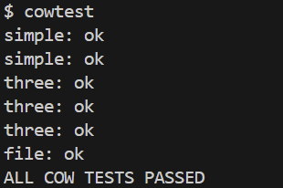  
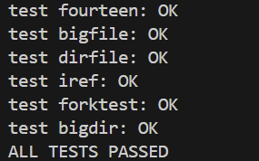  
### 实验遇到的问题和解决办法
- 误认为触发 COW 时，需要为进程分配并复制所有的共享内存页面   
通过观看 MIT 课程，深入了解 COW 机制，我了解到 COW 的正确工作方式是按需复制，以页为单位，每次只处理当前访问的页面，发生缺页中断时，只需要为该页面分配内存并映射。  
这让我体会了为什么 COW 机制对内存的使用效率高。
- 不理解为什么要修改 copyout 函数  
最初实现 COW 时，没有修改 copyout 函数，导致某些系统调用失败。  
通过调试发现，copyout 函数在向用户空间写入数据时遇到了 COW 页面，但由于页面标记为只读，写操作失败。  
我忽略了内核代码向用户空间写入时也需要触发 COW ，误认为只有用户程序的写操作才会触发 COW。
### 实验心得
通过本次 xv6 写时复制实验，我对操作系统中虚拟内存管理的高级机制有了更加深刻的认识。实验过程不仅仅是代码的实现，更重要的是让我体会到现代操作系统在性能优化方面的精妙设计思想。
- 深入理解 COW 机制的优雅设计  
起初我对 COW 机制的理解比较浅显，认为它只是简单的"延迟复制"。但通过实际实现，我才真正体会到这一机制的精妙之处。COW 机制巧妙地利用了程序执行的局部性原理：大多数 fork( ) 后的进程只会修改很少的页面，甚至在 fork + exec 模式下完全不修改任何页面。这种基于统计规律的优化设计让我深深震撼，它体现了操作系统设计者对程序运行模式的深入洞察。
- 感受硬件与软件协同的艺术  
在实现 COW 过程中，我深刻体会到了硬件与软件协同工作的精妙。通过巧妙利用 RISC-V 页表项中的 RSW 保留位来标记 COW 页面，将原本可写的页面设置为只读触发页面错误，然后在 trap 处理中完成真正的页面复制，这一系列操作展现了操作系统如何充分利用硬件特性来实现复杂的软件功能。特别是当我看到 CPU 自动触发页面错误，内核透明地处理后用户程序继续执行时，我真正理解了什么叫"硬件加速的软件抽象"。
- 体会内存管理的精细化控制
实验中最让我印象深刻的是引用计数系统的设计。起初我觉得这只是简单的计数器，但实现过程中我逐渐理解到，这个看似简单的机制实际上承载着内存安全的重要职责。每一次 kaddref( ) 和 kfree( ) 的调用都需要精确控制，一个错误就可能导致内存泄漏或者更严重的内存访问错误。这让我深刻认识到，操作系统内核开发需要极其严谨的态度，容不得半点马虎。
### 实验得分

## Lab Multithreading
### 实验目的
本实验旨在深入理解多线程编程的核心概念和实现机制，通过三个递进式的实验任务，全面掌握用户态线程切换、线程同步和并行编程优化技术，提高系统并发性能和程序设计能力。  
通过完成本次实验，旨在深入理解以下几个关键概念：
1. 用户态线程管理机制
    - 线程上下文切换原理：
        - 寄存器保存与恢复：掌握 callee-save 寄存器的保存策略和上下文切换的底层实现。
        - 栈管理机制：理解每个线程独立栈空间的分配、使用和管理方法。 
        - 线程调度算法：学会实现简单的协作式调度器，理解线程状态转换。
        - 汇编语言编程：通过 RISC-V 汇编实现高效的线程切换函数。
    - 用户态线程系统设计：
        - 线程控制块（TCB）设计：理解线程元数据的组织和管理方式。
        - 线程生命周期管理：掌握线程创建、运行、阻塞和销毁的完整流程。
        - 协作式调度模型：理解用户态线程的非抢占式调度特点和实现方法。
        - 性能优化考量：学会权衡上下文切换开销和调度效率。
2. 多线程并发控制与同步
    - 竞态条件识别与解决：
        - 临界区保护：理解共享资源访问中的数据竞争问题和解决方案。
        - 互斥锁机制：掌握 pthread_mutex 的使用方法和锁粒度设计策略。
        - 死锁预防：学会识别和避免多锁环境下的死锁问题。
        - 性能权衡：理解锁竞争对程序性能的影响和优化方法。
    - 高效并行编程技术：
        - 细粒度锁设计：掌握通过减小锁粒度提高并发度的设计方法。
        - 并行加速比分析：学会测量和分析多线程程序的性能提升效果。
3. 线程同步原语与屏障机制
    - 条件变量同步模式：
        - pthread_cond_wait / signal 机制：掌握基于条件变量的线程协调方法。
        - 等待 - 通知模式：理解生产者 - 消费者类型问题的标准解决方案。
        - 虚假唤醒处理：学会正确使用 while 循环检查条件避免虚假唤醒。
        - 原子操作保证：理解条件变量操作的原子性要求和实现原理。
    - 屏障同步机制实现：
        - 全局同步点设计：掌握让所有线程在特定点同步的实现方法。
        - 轮次管理策略：理解多轮屏障同步中的状态维护和转换机制。
        - 竞争条件避免：学会在复杂同步场景下避免竞态条件的设计技巧。
        - 扩展性考虑：理解屏障机制在不同线程数量下的性能特征。
### 实验原理
#### 用户态线程切换原理
用户态线程的核心在于为每个线程维护独立的执行环境。  
这个执行环境主要包含三个关键组成部分：  
- 寄存器状态：包括程序计数器用于记录线程执行到的指令位置、栈指针用于维护函数调用栈的位置、以及各种通用寄存器保存的计算结果。
- 独立的栈空间：每个线程拥有自己的栈用于函数调用、参数传递和局部变量存储。
- 控制信息：包括线程的运行状态、调度优先级等管理数据。

上下文切换是多线程系统的核心操作，其实现必须在汇编语言层面进行。切换过程分为两个对称的阶段：保存当前线程状态和恢复目标线程状态。  
- 保存阶段：系统需要将当前正在执行线程的所有寄存器值存储到该线程的上下文结构中。
- 恢复阶段：系统从目标线程的上下文结构中读取之前保存的寄存器值，将这些值重新加载到处理器的寄存器中。  

用户态线程通常采用协作式调度模型，这意味着线程必须主动让出处理器控制权。当一个线程完成一段工作或需要等待某个条件时，它会调用调度函数来选择下一个要运行的线程。
#### 哈希表并发访问与互斥同步原理
- 竞态条件的产生机制  
当多个线程同时访问共享数据结构时，就可能出现竞态条件。以哈希表的插入操作为例，单线程环境下的插入过程是安全的：分配新节点、设置节点数据、读取当前链表头、将新节点链接到链表头部。  
但在多线程环境下，这个看似简单的操作序列就可能出现问题。假设两个线程几乎同时插入不同的键值到同一个哈希桶中，它们都会读取到相同的旧链表头指针，然后分别将各自的新节点链接到这个旧指针上。但由于最后的链表头更新操作不是原子的，后执行更新的线程会覆盖前一个线程的更新，导致前一个线程插入的节点丢失。  
- 互斥锁的同步机制  
互斥锁是解决竞态条件最基本和最重要的工具。它的工作原理基于一个简单但强大的概念：在任何时刻，只允许一个线程持有锁并访问受保护的共享资源。  
当线程需要访问临界区时，它首先尝试获取相应的互斥锁。如果锁当前未被任何线程持有，该线程成功获取锁并进入临界区执行；如果锁已被其他线程持有，该线程就会被阻塞，直到锁被释放。当线程完成临界区操作后，必须释放锁，让其他等待的线程有机会获取锁。  
这种机制确保了临界区代码的串行化执行，从而避免了多线程并发访问导致的数据不一致问题。在哈希表例子中，将整个插入操作放在锁的保护下，就能确保每次只有一个线程执行插入，避免了数据丢失。  
- 细粒度锁的优化策略  
虽然全局锁能够解决数据一致性问题，但它也严重限制了程序的并发性能。当多个线程频繁访问哈希表时，它们必须串行等待全局锁，这就抵消了多线程带来的性能优势。  
细粒度锁是一种重要的优化策略，其核心思想是减小锁的保护范围，提高并发度。对于哈希表，一个自然的优化是为每个哈希桶分配独立的锁。这样，访问不同哈希桶的操作就可以并行执行，只有访问同一个桶的操作需要互斥。  
这种优化的效果很显著：在理想情况下，如果线程访问的键值均匀分布在不同的哈希桶中，程序就能获得接近线性的加速比。但细粒度锁也增加了程序的复杂性，需要仔细设计以避免死锁等问题。  
#### 屏障同步与条件变量原理
- 屏障同步的基本语义
屏障同步是一种重要的线程协调机制，它定义了程序执行中的一个全局同步点：所有参与的线程都必须到达这个点，然后才能继续执行后续代码。这种同步模式在并行计算中非常常见，特别是在需要阶段性同步的算法中。  
屏障的实现需要维护几个关键状态：当前到达屏障的线程数量、总的参与线程数量、以及当前的轮次编号。轮次编号特别重要，因为同一个屏障会被重复使用，需要区分不同轮次的同步操作。  
- 条件变量的工作原理  
条件变量是实现屏障同步的核心工具，它提供了一种高效的线程等待和通知机制。与简单的忙等待不同，条件变量允许线程在等待某个条件时完全让出处理器，避免浪费系统资源。  
条件变量的关键特性是它与互斥锁的紧密集成。当线程调用等待函数时，系统会原子地执行两个操作：释放关联的互斥锁，然后将线程置于等待状态。这种原子性至关重要，它避免了释放锁和进入等待状态之间的竞态条件。  
当条件满足时，其他线程可以通过信号函数唤醒等待的线程。被唤醒的线程会自动重新获取互斥锁，然后从等待函数返回。这确保了线程在检查条件和执行后续操作时拥有适当的同步保护。  
### 实验步骤
#### Uthread: switching between threads
- 实现 user / uthread_switch.S
    ```S
    thread_switch:
            /* 保存当前线程的寄存器到 old context */
            sd ra, 0(a0)      /* 保存返回地址 */
            sd sp, 8(a0)      /* 保存栈指针 */
            sd s0, 16(a0)     /* 保存 s0 */
            sd s1, 24(a0)     /* 保存 s1 */
            sd s2, 32(a0)     /* 保存 s2 */
            sd s3, 40(a0)     /* 保存 s3 */
            sd s4, 48(a0)     /* 保存 s4 */
            sd s5, 56(a0)     /* 保存 s5 */
            sd s6, 64(a0)     /* 保存 s6 */
            sd s7, 72(a0)     /* 保存 s7 */
            sd s8, 80(a0)     /* 保存 s8 */
            sd s9, 88(a0)     /* 保存 s9 */
            sd s10, 96(a0)    /* 保存 s10 */
            sd s11, 104(a0)   /* 保存 s11 */

            /* 从 new context 恢复新线程的寄存器 */
            ld ra, 0(a1)      /* 恢复返回地址 */
            ld sp, 8(a1)      /* 恢复栈指针 */
            ld s0, 16(a1)     /* 恢复 s0 */
            ld s1, 24(a1)     /* 恢复 s1 */
            ld s2, 32(a1)     /* 恢复 s2 */
            ld s3, 40(a1)     /* 恢复 s3 */
            ld s4, 48(a1)     /* 恢复 s4 */
            ld s5, 56(a1)     /* 恢复 s5 */
            ld s6, 64(a1)     /* 恢复 s6 */
            ld s7, 72(a1)     /* 恢复 s7 */
            ld s8, 80(a1)     /* 恢复 s8 */
            ld s9, 88(a1)     /* 恢复 s9 */
            ld s10, 96(a1)    /* 恢复 s10 */
            ld s11, 104(a1)   /* 恢复 s11 */
            
            ret               /* 跳转到新线程 (通过 ra 寄存器) */
    ```
-  修改 user / uthread.c
    - 定义上下文结构，保存 callee-save 寄存器
        ```c
        struct context {
            uint64 ra;
            uint64 sp;

            // callee-save 寄存器
            uint64 s0;
            uint64 s1;
            uint64 s2;
            uint64 s3;
            uint64 s4;
            uint64 s5;
            uint64 s6;
            uint64 s7;
            uint64 s8;
            uint64 s9;
            uint64 s10;
            uint64 s11;
        };

        struct thread {
            char       stack[STACK_SIZE]; /* 线程的栈 */
            int        state;             /* 运行状态 */
            struct context context;       /* 保存的寄存器状态 */
        };
        ```
    - 补全 thread_schedule 函数
        ```c
        /* YOUR CODE HERE
         * 调用 thread_switch 进行实际的线程切换
         * 第一个参数是当前线程的 context 地址
         * 第二个参数是要切换到的线程的 context 地址
         */
        thread_switch((uint64)&t->context, (uint64)&current_thread->context);
        ```
    - 补全 thread_create 函数
        ```c
        // 检查是否找到空闲槽位
        if (t >= all_thread + MAX_THREAD) {
            printf("thread_create: no free thread slots\n");
            return;  
        }

        t->state = RUNNABLE;
        // YOUR CODE HERE
        memset((void *)&t->stack, 0, STACK_SIZE);
        memset((void *)&t->context, 0, sizeof(struct context));
        // 设置栈指针到栈顶
        t->context.sp = (uint64)t->stack + STACK_SIZE;
        // 设置返回地址为要执行的函数
        // 当 thread_switch 返回时，会跳转到这个函数执行
        t->context.ra = (uint64)func;

        // 其他寄存器可以初始化为 0
        t->context.s0 = 0;
        t->context.s1 = 0;
        t->context.s2 = 0;
        t->context.s3 = 0;
        t->context.s4 = 0;
        t->context.s5 = 0;
        t->context.s6 = 0;
        t->context.s7 = 0;
        t->context.s8 = 0;
        t->context.s9 = 0;
        t->context.s10 = 0;
        t->context.s11 = 0;
        ```
- 实验结果  
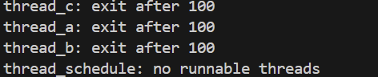
#### Using threads
- 运行测试程序    
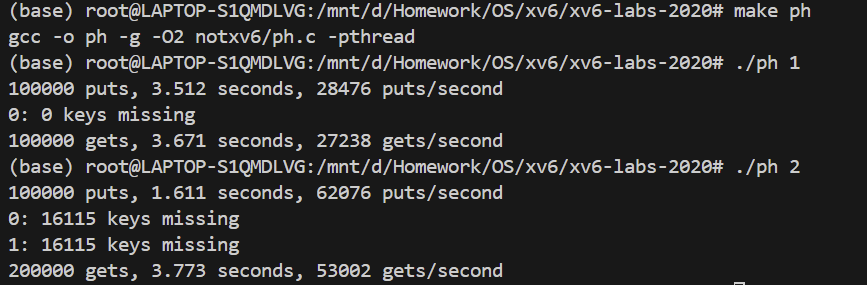
- 分析并回答 Why are there missing keys with 2 threads, but not with 1 thread?  
    ```txt
    两个线程同时操作同一个哈希桶时会发生竞争条件：
    1. 线程A和线程B同时调用put()，key哈希到同一个桶
    2. 两个线程都读取到table[i] = NULL
    3. 两个线程都认为需要插入新节点
    4. 两个线程都调用insert()创建新节点
    5. 两个线程都尝试更新table[i]指针
    6. 后更新的线程覆盖了前一个线程的更新
    7. 导致前一个线程插入的key丢失
    ```
- 修改 notxv6 / ph.c 
    - 为每个桶设置一个锁  
        ```c
        pthread_mutex_t locks[NBUCKET];  // 每个桶一个锁
        ```
    - 初始化锁
        ```c
        for (int i = 0; i < NBUCKET; i++) {
            pthread_mutex_init(&locks[i], NULL);
        }
        ```
    - 在 put、get 函数中使用锁
        ```c
        static 
        void put(int key, int value)
        {
            int i = key % NBUCKET;
            pthread_mutex_lock(&locks[i]); // 只锁定对应的桶
            ... 其余代码保持不变 ...
            pthread_mutex_unlock(&locks[i]); // 释放桶锁
        }

        static struct entry*
        get(int key)
        {
            int i = key % NBUCKET;
            pthread_mutex_lock(&locks[i]); // 只锁定对应的桶
            ... 其余代码保持不变 ...
            pthread_mutex_unlock(&locks[i]); // 释放桶锁
            return e;
        }
        ```
- 实验结果  
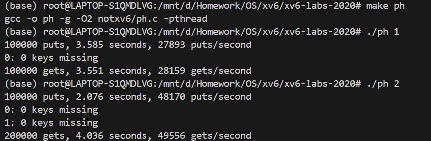
#### Barrier
- 实现 notxv6 / barrier.c 中的 barrier 函数
    ```c
    static void 
    barrier()
    {
        // YOUR CODE HERE
        // 获取互斥锁，保护共享状态
        pthread_mutex_lock(&bstate.barrier_mutex);
        
        // 增加到达屏障的线程计数
        bstate.nthread++;
        
        // 所有线程到达
        if (bstate.nthread == nthread) {
            // 进入下一轮
            bstate.round++;
            bstate.nthread = 0;
            // 唤醒所有线程
            pthread_cond_broadcast(&bstate.barrier_cond);
        } else {
            // 记录当前轮数
            int current_round = bstate.round;

            // 只要还在同一轮，就继续等待
            while (bstate.round == current_round){
                pthread_cond_wait(&bstate.barrier_cond, &bstate.barrier_mutex);
            }
        }
        // 释放互斥锁
        pthread_mutex_unlock(&bstate.barrier_mutex);
    }
    ```
- 实验结果  
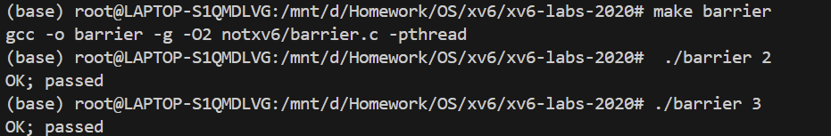
### 实验遇到的问题和解决办法
- 不理解条件变量与锁的关系  
在 barrier 实验中，我注意到线程等待时并没有释放锁，但其他线程可以访问互斥资源，这让我产生了困惑。
为此我查阅了 pthread_cond_wait 的详细工作机制，这个函数实际上原子地执行三个步骤：  
- 释放锁并进入等待状态
- 等待信号
    ```c
    // 线程在这里阻塞，等待其他线程调用：
    // pthread_cond_signal() 或 pthread_cond_broadcast()
    ```
- 被唤醒时重新获取锁  

我理解了同步变量和锁的密不可分。
### 实验心得
通过本次多线程实验，我深刻体验了从底层线程切换机制到高层同步原语的完整学习过程，获得了对并发编程的全面认识和实践经验。  
- 对线程切换机制的深入理解  
在实现用户态线程切换时，我最初对为什么只需要保存 callee-save 寄存器感到困惑。通过仔细分析 RISC-V 调用约定，我明白了 caller-save 寄存器在函数调用前已经被调用者妥善处理，而 callee-save 寄存器则是被调用函数必须保证不变的。这种设计既保证了正确性，又最大化了性能效率。  
编写汇编代码让我更加深刻地理解了线程切换的本质：实际上就是一次“欺骗性”的函数调用。当线程 A 调用 thread_switch 后，通过巧妙地修改返回地址，使得函数“返回”了线程 B 的执行位置。这种设计的优雅之处在于，每个线程都认为自己只是从一个普通的函数调用中返回，完全感受不到中间发生了上下文切换。  
- 并发控制的复杂性认知  
在哈希表并发访问实验中，我亲身体验了竞态条件的微妙性。看似简单的链表插入操作，在多线程环境下却可能导致数据丢失。这让我深刻认识到，并发编程中的“原子性”不是天然存在的，而是需要通过精心设计的同步机制来保证。  
从全局锁到细粒度锁的优化过程，让我理解了并发编程中性能与复杂性的权衡。全局锁虽然简单可靠，但严重限制了并发度；细粒度锁虽然提高了性能，但也增加了设计的复杂性。这种权衡在实际系统设计中无处不在，需要根据具体场景做出合理选择。  
- 同步原语的精妙设计  
屏障同步实验是最具挑战性的部分，它让我深刻理解了条件变量的工作机制。起初我不理解 pthread_cond_wait 的原子性操作，认为线程在等待时应该持有锁，这会导致死锁。通过深入学习，我明白了条件变量“释放锁 - 等待 - 重新获取锁”的原子操作序列，这种设计巧妙地避免了竞态条件。  
轮次管理机制的设计也让我印象深刻。同一个屏障对象需要支持多轮使用，这就需要区分不同轮次的同步操作。通过轮次编号和 while 循环检查，系统能够正确处理虚假唤醒和多轮屏障的复杂交互。  

总的来说，这次实验不仅让我掌握了多线程编程的基本技能，更重要的是培养了我对并发问题的敏感性和系统性思考能力，为后续的系统编程学习奠定了坚实的基础。
### 实验得分

## Lab lcoks
### 实验目的
本实验的目标是通过重新设计数据结构和锁策略来提高 xv6 系统的并行性，主要涉及两个部分：
- 内存分配器优化：将单一的全局空闲链表改为每个 CPU 一个空闲链表。
- 块缓存优化：将单一的全局缓存链表改为基于哈希桶的分布式缓存。  

通过完成本次实验，旨在深入理解以下几个关键概念：  
- 多核系统并发控制机制：
    - 锁竞争问题分析与诊断。
    - 并行化设计原理与实践。
- 内存分配器并发优化技术：
    - Per - CPU 资源管理架构。
    - 动态负载均衡与容错处理。
- 块缓存系统并发架构设计：
    - 分布式缓存管理机制。
    - 高效 LRU 替换算法实现。
### 实验原理
#### 实验背景
在多核系统中，多个 CPU 核心可以同时执行不同的进程或线程。然而，当这些并发执行流需要访问共享资源时，就需要使用锁机制来保证数据一致性和避免竞争条件。  
当多个 CPU 核心同时尝试获取同一个锁时，硬件层面的原子操作确保只有一个能够成功，其他核心必须不断尝试或者进入等待状态。这种重复尝试的过程会消耗大量的 CPU 资源，同时导致原本可以并行执行的操作被强制串行化。    
更严重的是，锁竞争还会引发缓存一致性问题。在多核系统中，每个 CPU 都有自己的缓存，当锁的状态在不同 CPU 之间频繁变化时，相关的缓存行需要在不同 CPU 的缓存之间来回传递，这种现象称为“缓存行弹跳”，会严重影响系统性能。
#### 内存分配器优化
- Per - CPU 设计的理论基础  
Per - CPU 设计的核心思想是将原本的单一共享资源分解为多个独立的资源，每个 CPU 拥有自己的资源副本。  
我们可以为每个 CPU 维护一个独立的空闲内存链表。这样做的好处是显而易见的：不同 CPU 上的内存操作完全不会相互干扰，可以真正实现并行执行。每个 CPU 只需要获取自己的锁，而不需要与其他 CPU 竞争。  
- 内存窃取机制  
不同CPU的内存使用模式可能不平衡。某些 CPU 可能分配了大量内存但很少释放，而另一些 CPU 可能相反。  
当一个 CPU 的本地内存池为空时，它可以尝试从其他 CPU 的内存池中“窃取”一些内存页面。  
这个机制的设计需要平衡两个目标：一方面要尽可能保持 Per - CPU 设计的并行性优势，另一方面要确保系统整体的内存利用效率。
#### 块缓存优化  
- 原始块缓存设计的性能限制  
xv6 的块缓存系统原本采用了经典的LRU（Least Recently Used）设计：所有的缓存块都被组织在一个双向链表中，最近访问的块位于链表头部，最久未访问的块位于链表尾部。当需要淘汰缓存块时，总是选择尾部的块进行替换。  
这种设计的问题在于它要求所有的缓存操作都是串行的。每次访问缓存块时，都需要将该块移动到链表头部，这个操作需要修改链表结构，因此必须获取全局锁。更严重的是，即使是读取操作也需要修改 LRU 链表，这意味着读操作也不能并行化。  
在现代存储系统中，磁盘 I / O 是一个非常昂贵的操作，因此缓存系统的效率对整体性能有着决定性的影响。如果缓存操作都必须串行化，就无法充分发挥多核系统在 I / O 密集型工作负载下的性能优势。  
-  哈希桶设计的分散化原理  
哈希桶设计的核心是使用哈希函数将不同的磁盘块映射到不同的桶中，每个桶维护自己的缓存块列表和锁。这样，当不同的进程访问不同的磁盘块时，只要这些块被哈希到不同的桶中，就可以并行进行，不会相互干扰。  
- 时间戳 LRU 机制的设计原理  
为每个缓存块记录其最后访问时间，使用系统的全局时钟作为时间源。当需要进行 LRU 替换时，扫描所有桶找到时间戳最小（即最久未访问）的块进行替换。  
### 实验步骤
#### Memory allocator
- 修改 kernel / kalloc.c 中的 kmem 结构
    ```c
    struct {
    struct spinlock lock;
    struct run *freelist;
    } kmem[NCPU];
    ```
- 修改 kinit 函数
    ```c
    void
    kinit()
    {
        for (int i = 0; i < NCPU; i++) {
            char name[9] = {0};
            snprintf(name, 8, "kmem-%d", i);
            initlock(&kmem[i].lock, name);
        }
        freerange(end, (void*)PHYSTOP);
    }
    ```
- 重写 kfree 函数
    ```c
    r = (struct run*)pa;

    // 获取当前CPU ID，需要关闭中断保证安全
    push_off();
    int cpu_id = cpuid();

    acquire(&kmem[cpu_id].lock);
    r->next = kmem[cpu_id].freelist;
    kmem[cpu_id].freelist = r;
    release(&kmem[cpu_id].lock);

    pop_off();
    ```
- 重写 kalloc 函数
    ```c
    push_off();
    int cpu_id = cpuid();

    acquire(&kmem[cpu_id].lock);
    r = kmem[cpu_id].freelist;
    if (r)
        kmem[cpu_id].freelist = r->next;
    release(&kmem[cpu_id].lock);

    // 如果当前CPU没有空闲内存，尝试从其他CPU获取
    if (!r) {
        for (int i = 0; i < NCPU; i++) {
        if(i == cpu_id) 
            continue; // 跳过当前CPU
        
        acquire(&kmem[i].lock);
        r = kmem[i].freelist;
        if (r) {
            kmem[i].freelist = r->next;
            release(&kmem[i].lock);
            break;
        }
        release(&kmem[i].lock);
        }
    }
    
    pop_off();
    ```
- 实验结果  
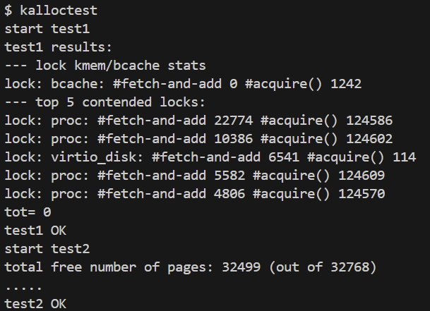  
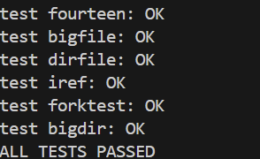
#### Buffer cache
- 修改数据结构
    ```c
    struct {
    struct spinlock lock;
    struct buf head;
    } bucket[NBUCKET];

    struct {
    struct spinlock lock;
    struct buf buf[NBUF];
    } bcache;
    ```
- buf 结构体中增加时间戳字段
    ```c
    uint timestamp;   // 添加时间戳字段
    ```
- 实现哈希函数
    ```c
    // 哈希函数：将 (dev, blockno) 映射到桶
    int
    hash(uint dev, uint blockno)
    {
        return (dev + blockno) % NBUCKET;
    }
    ```
- 修改初始化函数
    ```c
    void
    binit(void)
    {
        struct buf *b;

        initlock(&bcache.lock, "bcache");

        // 初始化每个桶的锁和链表
        for (int i = 0; i < NBUCKET; i++) {
            char name[16];
            snprintf(name, sizeof(name), "bcache.bucket_%d", i);
            initlock(&bucket[i].lock, name);
            
            // 初始化桶的循环链表
            bucket[i].head.prev = &bucket[i].head;
            bucket[i].head.next = &bucket[i].head;
        }

        // 将所有缓存块分散到各个桶中
        for (b = bcache.buf; b < bcache.buf + NBUF; b++) {
            int bucket_id = (b - bcache.buf) % NBUCKET;

            b->next = bucket[bucket_id].head.next;
            b->prev = &bucket[bucket_id].head;
            initsleeplock(&b->lock, "buffer");
            b->timestamp = ticks;
            bucket[bucket_id].head.next->prev = b;
            bucket[bucket_id].head.next = b;
        }
    }
    ```
- 重写 bget 函数
    ```c
    static struct buf*
    bget(uint dev, uint blockno)
    {
        struct buf *b;
        int bucket_id = hash(dev, blockno);

        acquire(&bucket[bucket_id].lock);

        // 在对应桶中查找是否已缓存
        for (b = bucket[bucket_id].head.next; b != &bucket[bucket_id].head; b = b->next) {
            if (b->dev == dev && b->blockno == blockno) {
                b->refcnt++;
                release(&bucket[bucket_id].lock);
                acquiresleep(&b->lock);
                return b;
            }
        }

        // 缓存未命中，需要分配新的缓存块
        release(&bucket[bucket_id].lock);

        acquire(&bcache.lock);
        acquire(&bucket[bucket_id].lock);

        // 双重检查：可能在等待锁期间其他进程已经缓存了该块
        for (b = bucket[bucket_id].head.next; b != &bucket[bucket_id].head; b = b->next) {
            if (b->dev == dev && b->blockno == blockno) {
                b->refcnt++;
                release(&bucket[bucket_id].lock);
                release(&bcache.lock);
                acquiresleep(&b->lock);
                return b;
            }
        }
        
        // 查找可重用的缓存块（LRU策略）
        struct buf *least_recent = 0;
        uint least_recent_ticks = 0xFFFFFFFF;

        // 先在当前桶中查找
        for (b = bucket[bucket_id].head.next; b != &bucket[bucket_id].head; b = b->next) {
            if (b->refcnt == 0 && b->timestamp < least_recent_ticks) {
                least_recent = b;
                least_recent_ticks = b->timestamp;
            }
        }

        // 如果当前桶没有可用的，查找其他桶
        if (!least_recent) {
            for (int i = 0; i < NBUCKET; i++) {
                if (i == bucket_id) 
                    continue;
                
                acquire(&bucket[i].lock);
                for (b = bucket[i].head.next; b != &bucket[i].head; b = b->next) {
                    if (b->refcnt == 0 && b->timestamp < least_recent_ticks) {
                        least_recent = b;
                        least_recent_ticks = b->timestamp;
                    }
                }
                release(&bucket[i].lock);
            }
        }

        if (!least_recent) {
            panic("bget: no buffers");
        }

        // 如果选中的缓存块在其他桶中，需要移动它
        if (least_recent) {
            int old_bucket = hash(least_recent->dev, least_recent->blockno);
            if (old_bucket != bucket_id) {
                acquire(&bucket[old_bucket].lock);
                // 从旧桶中移除
                least_recent->next->prev = least_recent->prev;
                least_recent->prev->next = least_recent->next;
                release(&bucket[old_bucket].lock);
                
                // 添加到新桶
                least_recent->next = bucket[bucket_id].head.next;
                least_recent->prev = &bucket[bucket_id].head;
                bucket[bucket_id].head.next->prev = least_recent;
                bucket[bucket_id].head.next = least_recent;
            }
            least_recent->dev = dev;
            least_recent->blockno = blockno;
            least_recent->valid = 0;
            least_recent->refcnt = 1;

            release(&bucket[bucket_id].lock);
            release(&bcache.lock);
            acquiresleep(&least_recent->lock);
            return least_recent;
        }

        panic("bget: no buffers");
    }
    ```
- 修改 brelse 函数
    ```c
    void
    brelse(struct buf *b)
    {
        if (!holdingsleep(&b->lock))
            panic("brelse");

        releasesleep(&b->lock);

        int bucket_id = hash(b->dev, b->blockno);

        acquire(&bucket[bucket_id].lock);
        b->refcnt--;
        if (b->refcnt == 0) {
            b->timestamp = ticks;
        }
        release(&bucket[bucket_id].lock);
    }
    ```
- 实验结果  
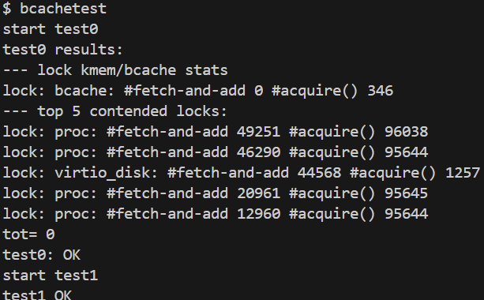  
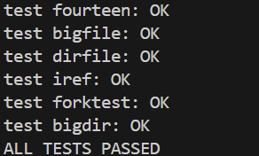
### 实验心得
- 深入理解了并发编程的核心挑战  
通过这个实验，我真正体会到了多核系统中并发编程的复杂性。在单核系统的思维模式下，我们习惯于用顺序的方式思考问题，但在多核环境中，必须时刻考虑多个执行流的相互影响。  
最让我印象深刻的是锁竞争问题的严重性。在实验开始时，看到 kalloctest 显示的 #fetch - and - add 83375 这个数字时，我意识到原来看似简单的内存分配操作背后隐藏着如此激烈的竞争。每一次 fetch - and - add 都代表着一次失败的锁获取尝试，而 83375 次失败意味着大量的 CPU 资源被浪费在了无意义的等待上。  
- 体会到了系统设计中“分而治之”的思想  
Per - CPU 设计让我深刻理解了“分而治之”在系统设计中的重要性。将原本的单一全局资源分解为多个独立的子资源，不仅解决了锁竞争问题，更重要的是从根本上改变了系统的工作模式：从串行化执行转变为真正的并行执行。  
在实现内存分配器时，看到每个 CPU 都有自己的内存池，它们可以独立工作而不相互干扰，这种设计的优雅让我深感震撼：这不仅仅是一个技术实现，更是一种设计哲学的体现。
- 学会了在复杂性和性能之间进行权衡  
实验过程中最大的挑战不是编写代码，而是在各种设计选择中进行权衡。Per - CPU 设计带来了性能提升，但也引入了内存窃取的复杂性；哈希桶设计解决了缓存并发问题，但也需要处理死锁预防和负载均衡。  
特别是在实现块缓存优化时，我花了大量时间思考如何处理缓存块的迁移问题。起初的实现总是出现死锁，经过反复调试才理解了锁排序的重要性。这个过程让我明白，在多锁系统中，每一个设计决定都需要考虑其对整个系统的影响。  
### 实验得分

## Lab file system
### 实验目的
本实验旨在深入理解 xv6 文件系统的核心机制，通过两个关键功能的实现来掌握文件系统的设计原理：  
- 大文件支持：实现双重间接块寻址，将文件大小限制从 268 块扩展到 65,803 块。  
- 符号链接：添加 symlink( ) 系统调用和符号链接跟随机制，支持跨设备文件引用。  

通过完成本次实验，旨在深入理解以下几个关键概念：  
- 理解文件系统的存储结构：
    - 掌握 inode 的结构和作用。
    - 理解直接块、间接块的寻址机制。
    - 学习文件系统如何管理磁盘块。
- 扩展文件大小限制：
    - 将文件大小从 268 块扩展到 65,803 块。
    - 实现双重间接块（doubly-indirect block）机制。
    - 优化存储空间的使用效率。
- 深入理解块映射机制：
    - 分析 bmap( ) 函数的工作原理。
    - 掌握逻辑块号到物理块号的映射过程。
    - 学习动态分配磁盘块的策略。
- 理解文件系统的链接机制：
    - 区分硬链接和符号链接的差异。
    - 掌握符号链接的实现原理。
    - 理解路径解析的工作流程。
- 处理复杂的文件访问场景：
    - 实现符号链接的递归跟随。
    - 处理循环引用的检测和防护。
    - 支持 O_NOFOLLOW 标志的语义。
### 实验原理
#### 大文件支持
- 文件系统存储结构  
xv6 文件系统使用 inode 来管理文件的元数据和数据块地址。原始设计中，每个 inode 包含：  
    - 12 个直接块：直接存储数据块地址。
    - 1 个间接块：指向包含 256 个数据块地址的块。
    - 总容量：12 + 256 = 268 块。
- 双重间接块机制  
为支持更大文件，引入双重间接块：  
    - 11 个直接块：直接存储数据块地址。
    - 1 个间接块：指向包含 256 个数据块地址的块。
    - 1 个双重间接块：指向包含 256 个间接块地址的块，每个间接块又包含 256 个数据块地址。
    - 新容量：11 + 256 + 256×256 = 65,803 块。
- 块映射原理  
bmap( ) 函数负责将文件的逻辑块号转换为磁盘物理块号：
    - 直接块范围 (0 - 10)：直接从 ip->addrs[bn] 获取。
    - 间接块范围 (11 - 266)：通过 ip->addrs[11] 索引到间接块，再索引到数据块。
    - 双重间接块范围 (267 - 65802)：通过 ip->addrs[12] → 间接块 → 数据块的三级索引获取。
#### 符号链接
- 链接类型对比   
文件系统中存在两种链接方式：
    - 硬链接：直接指向同一个 inode。
    - 符号链接：存储目标路径，通过路径解析访问目标文件。
- 符号链接特点  
符号链接是一种特殊文件类型：  
    - 独立的 inode：符号链接有自己的 inode，类型为 T_SYMLINK 。
    - 存储内容：在数据块中存储目标文件的路径字符串。
    - 访问方式：通过读取路径字符串，再解析该路径来访问目标文件。
    - 跨设备：可以指向不同文件系统的文件（硬链接不行）。
    - 悬空链接：目标文件不存在时，符号链接仍然有效。
### 实验步骤
#### Large files
- 修改 kernel / fs.h 中的常量定义
    ```c
    #define NDIRECT 11
    #define NINDIRECT (BSIZE / sizeof(uint))
    #define MAXFILE (NDIRECT + NINDIRECT + NINDIRECT * NINDIRECT) // 11+256+65536=65803
    ```
- 修改 inode 结构
    - 在 kernel / fs.h 中修改 struct dinode
        ```c
        struct dinode {
        short type;           // File type
        short major;          // Major device number (T_DEVICE only)
        short minor;          // Minor device number (T_DEVICE only)
        short nlink;          // Number of links to inode in file system
        uint size;            // Size of file (bytes)
        uint addrs[NDIRECT+2];   // Data block addresses
        };
        ```
    - 在 kernel / file.h 中修改 struct inode
        ```c
        struct inode {
        uint dev;           // Device number
        uint inum;          // Inode number
        int ref;            // Reference count
        struct sleeplock lock; // protects everything below here
        int valid;          // inode has been read from disk?

        short type;         // copy of disk inode
        short major;
        short minor;
        short nlink;
        uint size;
        uint addrs[NDIRECT+2];
        };
        ```
- 在 kernel / fs.c 中修改 bmap( ) 函数
    ```c
    static uint
    bmap(struct inode *ip, uint bn)
    {
        uint addr, *a;
        struct buf *bp;

        // 读取直接块
        if (bn < NDIRECT) {
            if ((addr = ip->addrs[bn]) == 0)
                ip->addrs[bn] = addr = balloc(ip->dev);
            return addr;
        }
        // 计算在间接块中的地址
        bn -= NDIRECT;

        // 单重间接块
        if (bn < NINDIRECT) {
            // Load indirect block, allocating if necessary.
            if ((addr = ip->addrs[NDIRECT]) == 0)
                ip->addrs[NDIRECT] = addr = balloc(ip->dev);
            // 读取间接块内容
            bp = bread(ip->dev, addr);
            a = (uint*)bp->data;
            // 查找目标数据块
            if ((addr = a[bn]) == 0) {
                a[bn] = addr = balloc(ip->dev);
                log_write(bp);
            }
            // 释放缓冲区并返回
            brelse(bp);
            return addr;
        }
        bn -= NINDIRECT;

        // 双重间接块
        if (bn < NINDIRECT * NINDIRECT) {
            // 计算双重间接块中的索引
            uint doubly_idx = bn / NINDIRECT; // 在双重间接块中的索引
            uint singly_idx = bn % NINDIRECT; // 在单重间接块中的索引

            // 加载或分配双重间接块
            if ((addr = ip->addrs[NDIRECT + 1]) == 0)
                ip->addrs[NDIRECT + 1] = addr = balloc(ip->dev);

            bp = bread(ip->dev, addr);
            a = (uint*)bp->data;

            // 加载或分配对应的单重间接块
            if ((addr = a[doubly_idx]) == 0) {
                a[doubly_idx] = addr = balloc(ip->dev);
                log_write(bp);
            }
            brelse(bp);

            bp = bread(ip->dev, addr);
            a = (uint*)bp->data;

            if ((addr = a[singly_idx]) == 0) {
                a[singly_idx] = addr = balloc(ip->dev);
                log_write(bp);
            }
            brelse(bp);
            return addr;
        }

        panic("bmap: out of range");
    }
    ```
- 在 kernel / fs.c 中修改 itrunc( ) 函数
    ```c
    void
    itrunc(struct inode *ip)
    {
        int i, j, k;
        struct buf *bp, *bp2;
        uint *a, *a2;

        for (i = 0; i < NDIRECT; i++) {
            if (ip->addrs[i]) {
                bfree(ip->dev, ip->addrs[i]);
            ip->addrs[i] = 0;
            }
        }

        if (ip->addrs[NDIRECT]) {
            bp = bread(ip->dev, ip->addrs[NDIRECT]);
            a = (uint*)bp->data;
            for (j = 0; j < NINDIRECT; j++) {
                if (a[j])
                    bfree(ip->dev, a[j]);
            }
            brelse(bp);
            bfree(ip->dev, ip->addrs[NDIRECT]);
            ip->addrs[NDIRECT] = 0;
        }

        // 释放双重间接块
        if (ip->addrs[NDIRECT + 1]) {
            bp = bread(ip->dev, ip->addrs[NDIRECT + 1]);
            a = (uint*)bp->data;

            // 遍历每个单重间接块
            for (j = 0; j < NINDIRECT; j++) {
                if (a[j]) {
                    bp2 = bread(ip->dev, a[j]);
                    a2 = (uint*)bp2->data;

                    // 释放数据块
                    for (k = 0; k < NINDIRECT; k++) {
                        if (a2[k])
                            bfree(ip->dev, a2[k]);
                    }
                    brelse(bp2);
                    bfree(ip->dev ,a[j]);
                }
            }

            brelse(bp);
            // 释放双重间接块本身
            bfree(ip->dev, ip->addrs[NDIRECT + 1]);
            ip->addrs[NDIRECT + 1] = 0;
        }

        ip->size = 0;
        iupdate(ip);
    }
    ```
- 实验结果  
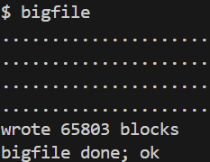  
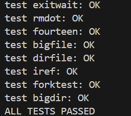  
#### Symbolic links
- 添加系统调用  
注册系统调用 sys_symlink 。
- 添加新的文件类型
    ```c
    // 在 kernel/stat.h 添加
    #define T_SYMLINK 4 // 符号链接类型
    ```
- 添加新的打开标志
    ```c
    // 在 kernel/fcntl.h 添加
    #define O_NOFOLLOW 0x008 // 不跟随符号链接
    ```
- 实现 symlink 系统调用
    ```c
    uint64
    sys_symlink(void)
    {
        char target[MAXPATH], path[MAXPATH];
        struct inode *ip;
        
        // 获取参数
        if (argstr(0, target, MAXPATH) < 0 || argstr(1, path, MAXPATH) < 0)
            return -1;

        begin_op();

        // 创建符号链接文件
        if ((ip = create(path, T_SYMLINK, 0, 0)) == 0) {
            end_op();
            return -1;
        }

        // 将目标路径写入符号链接文件的数据块
        if (writei(ip, 0, (uint64)target, 0, strlen(target)) != strlen(target)) {
            iunlockput(ip);
            end_op();
            return -1;
        }

        iunlockput(ip);
        end_op();
        return 0;
    }
    ```
- 修改 open 系统调用
    ```c
    if (omode & O_CREATE) {
        ...其余代码保持不变...
    }

    // 是软链接且 O_NOFOLLOW 没被设立起来
    int depth = 0;
    while (ip->type == T_SYMLINK && !(omode & O_NOFOLLOW)) {
        char ktarget[MAXPATH];
        // 从 inode 中读取数据
        if (readi(ip, 0, (uint64)ktarget, 0, MAXPATH) < 0) {
            iunlockput(ip);
            end_op();
            return -1;
        }
        iunlockput(ip);
        // target path 不存在
        if ((ip = namei(ktarget)) == 0) { 
            end_op();
            return -1;
        }

        ilock(ip);
        depth++;
        if (depth > 10) {
            //默认死循环
            iunlockput(ip);
            end_op();
            return -1;
        }
    }
    ```
- 实验结果  
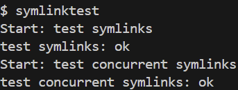  
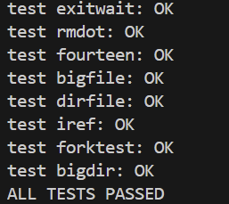  
### 实验遇到的问题和解决办法
- 大文件支持实验中，件块号超出了文件系统支持的最大范围  
通过 printf 调试和代码分析，发现问题出现在 bmap( ) 函数的双重间接块处理逻辑中：
    ```c
    // 缺少这行代码
    bn -= NINDIRECT;
    ```
    映射时需要将全局逻辑块号转换为各级结构内的相对索引，否则会导致越界访问。
### 实验心得
过本次文件系统实验，我深入理解了操作系统中文件系统的核心机制和设计原理，收获颇丰。  
- 对文件系统架构的深入理解  
在实现大文件支持的过程中，我真正理解了 xv6 文件系统的分层存储架构。从简单的直接块寻址到间接块，再到双重间接块，这种多级索引的设计巧妙地平衡了空间效率和访问性能。通过修改 bmap( ) 函数，我深刻体会到了逻辑块号到物理块号映射的复杂性，特别是在处理双重间接块时，需要进行两次间接寻址才能定位到真正的数据块。  
- 索引映射的重要性  
实验中最大的收获是理解了索引转换的关键作用。在调试双重间接块时，我遇到了块号越界的问题，通过仔细分析发现缺少了 bn -= NINDIRECT 这一关键步骤。这让我明白，在多级索引结构中，必须将全局逻辑地址转换为各级结构内的相对地址，否则会导致严重的越界访问。这个看似简单的问题实际上反映了系统设计中地址映射的重要性。
- 符号链接机制的理解  
实现符号链接功能让我对文件系统的链接机制有了更深入的认识。硬链接和符号链接的区别不仅仅是实现方式的不同，更体现了文件系统设计的哲学差异。符号链接通过存储路径字符串实现了更灵活的文件引用方式，支持跨设备链接，但同时也带来了循环引用的风险。在实现过程中，我学会了如何通过递归深度限制来防止无限循环，这种防护机制的设计思想值得借鉴。
### 实验得分
  
## Lab mmap
### 实验目的
本实验的主要目的是在 xv6 操作系统中实现内存映射文件（memory-mapped files）功能，通过添加 mmap 和 munmap 系统调用，让用户程序能够精确控制其地址空间。  
通过完成本次实验，旨在深入理解以下几个关键概念：  
- 理解内存映射机制：
    - 掌握内存映射文件的概念和工作原理。
    - 理解虚拟内存区域（VMA, Virtual Memory Area）的管理。
    - 学习如何将文件内容映射到进程的虚拟地址空间。
- 文件系统与内存管理的结合：
    - 学习文件描述符的引用计数管理。
    - 理解文件内容与内存页面之间的同步机制。
    - 掌握如何处理共享映射（MAP_SHARED）和私有映射（MAP_PRIVATE）。
### 实验原理
#### 内存映射文件的基本概念
内存映射文件是一种将文件内容直接映射到进程虚拟地址空间的技术。传统的文件读写需要通过系统调用将数据从文件系统拷贝到用户缓冲区，而内存映射则建立文件内容与内存页面之间的直接对应关系，使得访问文件就像访问普通内存一样简单高效。  
当程序通过 mmap 系统调用请求映射一个文件时，操作系统并不立即分配物理内存或读取文件内容，而是在进程的虚拟地址空间中预留一块区域，并记录这个区域与文件之间的映射关系。只有当程序真正访问这块内存区域时，才会触发页面错误，此时操作系统才分配物理页面并从文件中读取相应内容填充该页面。
####  虚拟内存区域（VMA）管理
每个进程都维护一个虚拟内存区域列表，用于记录所有通过 mmap 创建的内存映射。每个 VMA 包含以下关键信息：映射的起始虚拟地址、映射长度、访问权限（可读、可写、可执行）、映射标志（共享或私有）、对应的文件描述符以及在文件中的偏移量。  
当进程访问某个虚拟地址时，内核首先检查该地址是否落在某个 VMA 范围内。如果是，则根据 VMA 记录的信息进行相应处理；如果不是，则向进程发送段违例信号。VMA 的管理确保了内存映射的正确性和安全性。
####  页面错误处理流程
页面错误处理是内存映射文件实现的关键环节。当访问未映射的虚拟地址时，硬件会将控制权转交给内核的页面错误处理程序。处理程序首先获取引发错误的虚拟地址，然后遍历进程的 VMA 列表，寻找包含该地址的 VMA 。  
找到对应的 VMA 后，处理程序会分配一个新的物理页面，计算该虚拟地址在文件中对应的偏移量，使用文件系统的读取接口将文件数据加载到物理页面中。接下来，根据 VMA 记录的权限信息设置页表项的权限位，并在进程页表中建立虚拟地址到物理地址的映射。最后，处理程序返回用户态，程序可以继续执行刚才被中断的指令。
#### 文件引用计数管理
内存映射涉及文件系统和内存管理系统的协作，需要仔细管理文件的生命周期。当创建内存映射时，内核必须增加对应文件结构的引用计数，防止文件在映射存在期间被意外释放。这确保了即使用户程序关闭了文件描述符，映射的内存区域仍然可以正常访问文件内容。  
每个 VMA 都持有一个指向文件结构的指针，当 VMA 被创建时调用文件复制函数增加引用计数，当 VMA 被销毁时调用文件关闭函数减少引用计数。只有当文件的引用计数降为零时，文件结构才会被真正释放。
#### 共享映射与私有映射的区别
内存映射分为共享映射和私有映射两种模式。共享映射意味着对映射内存的修改会直接反映到文件中，多个进程映射同一文件时可以看到彼此的修改。私有映射则采用写时复制技术，当进程试图修改映射的内存时，内核会复制该页面，使修改只对当前进程可见，不会影响原文件或其他进程。  
对于共享映射，当页面被修改后，内核需要在适当的时候将修改写回到文件中。这通常发生在页面被换出、内存映射被撤销或进程退出时。私有映射的修改则永远不会写回原文件。
#### 内存映射的撤销机制
munmap 系统调用负责撤销指定地址范围内的内存映射。内核首先找到包含该地址范围的 VMA ，然后释放相应的物理页面。如果是共享映射且页面已被修改，需要先将修改写回文件。接下来，从进程页表中移除相应的映射关系，并减少文件的引用计数。  
撤销操作可能只影响 VMA 的一部分，这要求内核能够正确处理部分撤销的情况，必要时分割或调整 VMA 的范围。
### 实验步骤
- 添加系统调用  
注册系统调用 sys_mmap 和 sys_munmap 。
- 在 kernel / proc.h 中定义 VMA  
    ```c
    struct vma
    {
    uint64 addr;
    int length;
    int prot;
    int flags;
    int fd;
    int valid;
    struct file* file;
    };

    struct proc {
    ···其余代码保持不变···
    struct vma vmas[16];
    }
    ```
- 实现 mmap 系统调用
    ```c
    // kernel/sysfile.c
    uint64 
    sys_mmap(void)
    {
        uint64 addr;
        int length, prot, flags, fd, offset;

        // 获取参数
        if (argaddr(0, &addr) || argint(1, &length) < 0 || argint(2, &prot) < 0 || argint(3, &flags) < 0 || argint(4, &fd) < 0 || argint(5, &offset) < 0)
            return -1;

        struct proc * p = myproc();
        struct file* f;

        // 获取文件
        if (fd < 0 || fd >= NOFILE || (f = p->ofile[fd]) == 0)
            return -1;
        
        // 权限检查
        if (!f->readable) {
            if ((prot & PROT_READ)) 
                return -1;
        }
        if (!f->writable) {
            if ((prot & PROT_WRITE) && (flags & MAP_SHARED)) 
                return -1;
        }
        
        // 增加文件的引用计数
        filedup(f); 
        
        // 分配一块区域，然后放入对应的 VMA
        addr = p->sz; 
        if (p->sz + PGROUNDDOWN(length) >= MAXVA) 
            return -1;
        p->sz += PGROUNDUP(length);

        int found = 0;
        // 找到未使用的VMA
        for (int i = 0; i < 16; i++) {
            if (p->vmas[i].valid == 0) {
                p->vmas[i].addr = addr;
                p->vmas[i].length = length;
                p->vmas[i].prot = prot;
                p->vmas[i].flags = flags;
                p->vmas[i].fd = fd;
                p->vmas[i].file = f;
                p->vmas[i].valid = 1;
                found = 1;
                break;
            }
        }

        if (!found) 
            return -1;

        return addr;
    }
    ```
- 修改 usertrap 处理页面故障
    ```c
    else if (r_scause() == 13 || r_scause() == 15) {
        uint64 va = r_stval(); 
        struct proc* p = myproc();
        struct vma vma_cur;
        int found = 0;

        // 根据发生中断的虚拟地址找到对应的 VMA
        for (int i = 0; i < 16; i++) {
            if (va >= p->vmas[i].addr && va < p->vmas[i].addr + p->vmas[i].length) {
                vma_cur = p->vmas[i];
                found = 1;
                break;
            }
        }
        if (found) {
            // 分配对应的物理内存
            char * pa = kalloc(); 
            if (pa == 0) { 
                p->killed = 1; 
            }
            memset(pa, 0, PGSIZE); 

            ilock(vma_cur.file->ip);
            // 把数据读到物理内存中
            readi(vma_cur.file->ip, 0, (uint64)pa, va - vma_cur.addr, PGSIZE); 
            iunlock(vma_cur.file->ip);

            // 物理页映射的时候要注意flag
            uint64 flag = PTE_U;
            if (vma_cur.prot & (PROT_READ)) 
                flag |= PTE_R;
            if (vma_cur.prot & (PROT_WRITE)) 
                flag |= PTE_W;
            
            // 映射到页表
            if (mappages(p->pagetable, PGROUNDDOWN(va), PGSIZE, (uint64)pa, flag) != 0) { 
                kfree(pa); 
                p->killed = 1;
            }
        } else {
            p->killed = 1;
        }
    }
    ```
- 实现 munmap 系统调用
    ```c
    // kernel/sysfile.c
    uint64 
    sys_munmap(void)
    {
        uint64 addr;
        int length;

        if (argaddr(0, &addr) || argint(1, &length) < 0)
            return -1;

        struct proc * p = myproc();
        int found = 0;
        for (int i = 0; i < 16; i++) {
            // 找到与虚拟地址对应的 VMA
            if (addr >= p->vmas[i].addr && addr < p->vmas[i].addr + p->vmas[i].length) {
                found = 1;

                // 写回文件
                if (p->vmas[i].flags & MAP_SHARED) {
                    filewrite(p->vmas[i].file, p->vmas[i].addr, p->vmas[i].length);
                }
                // 取消映射
                uvmunmap(p->pagetable, addr, PGROUNDDOWN(length) / PGSIZE, 1);
                
                // 如果映射整个 VMA 的空间，取消映射时则要减少文件的引用计数
                if (addr == p->vmas[i].addr && length == p->vmas[i].length) {
                    fileclose(p->vmas[i].file);
                    p->vmas[i].valid = 0;
                }

                break;
            }
        }

        if (!found) 
            return -1;
        return 0;
    }
    ```
- 修改 kernel / pro.c 中修改 fork 函数
    ```c
    np->parent = p;

    for (int i = 0; i < 16; i++) {
        if (p->vmas[i].valid && p->vmas[i].file) {
            np->vmas[i] = p->vmas[i];
            // 增加文件的引用计数
            filedup(np->vmas[i].file); 
        }
    }
    ···其余代码保持不变···
    ```
- 修改 kernel / pro.c 中修改 exit 函数
    ```c
    if(p == initproc)
        panic("init exiting");

    for (int i = 0; i < 16; i++) {
        if (p->vmas[i].valid) {
            // 写回文件
            if (p->vmas[i].flags & (MAP_SHARED)) {
                filewrite(p->vmas[i].file, p->vmas[i].addr, p->vmas[i].length);
            }

            // 取消映射
            uvmunmap(p->pagetable, p->vmas[i].addr, PGROUNDDOWN(p->vmas[i].length) / PGSIZE, 1);

            // 减少文件的引用计数
            if (p->vmas[i].file)
                fileclose(p->vmas[i].file);
        }
    }
    ···其余代码保持不变···
    ```
- 修改 kernel / vm.c 中的 uvmunmap 函数
    ```c
    if ((*pte & PTE_V) == 0)
        // panic("uvmunmap: not mapped");
        continue;
    ```
- 修改 kernel / vm.c 中的 uvmcopy 函数
    ```c
    if ((*pte & PTE_V) == 0)
        // panic("uvmcopy: page not present");
        continue;
    ```
- 实验结果  
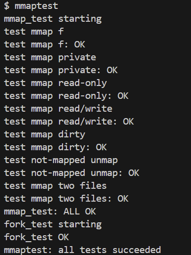  
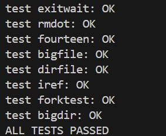
### 实验遇到的问题和解决办法
实验过程中，需要与 xv6 的文件系统进行交互，但对相关的文件管理函数和数据结构不够熟悉，导致实现过程中遇到诸多困难。  
通过查阅相关资料和源码分析，我了解了以下关键的文件管理机制：  
- 权限和标志参数的理解：
    - int prot ：内存保护标志，定义了映射内存的访问权限（读、写等）。
    - int flags ：映射行为标志，控制映射的特性（共享映射、私有映射等）。
    - int fd ：文件描述符，标识要映射的已打开文件。
- 进程文件描述符表的访问：  
p -> ofile[ fd ] ：访问进程的打开文件表。
- 文件引用计数管理：  
filedup( f ) ：增加文件引用计数。
- 文件内容读写：  
    - readi( struct inode *ip, int user_dst, uint64 dst, uint off, uint n ) ：从文件读取数据到目标缓冲区地址。
    - filewrite( struct file *f, uint64 addr, int n ) ：向文件写入数据。
- 文件引用释放：  
fileclose( struct file *f ) ：减少文件引用计数并可能释放文件。
### 实验心得
通过完成这次 mmap 实验，我深刻体会到了操作系统内核开发的复杂性和精密性。这个实验不仅仅是简单地添加两个系统调用，而是需要深入理解虚拟内存管理、文件系统、进程管理等多个子系统之间的协调工作。  
- 深入理解虚拟内存管理机制  
在实验过程中，我第一次真正理解了虚拟内存区域（VMA）的概念和作用。每个进程维护的 VMA 列表实际上是对其地址空间的精细化管理，记录了每块内存区域的属性、权限和用途。  
虚拟内存区域的设计体现了操作系统抽象的精髓。每个 VMA 结构体包含映射的起始地址、长度、保护权限、映射标志、文件描述符和文件指针等关键信息。这些字段之间存在着严格的逻辑关系：起始地址和长度定义了虚拟地址空间的范围，保护权限控制了对该区域的访问方式，映射标志决定了内存修改是否影响原文件，文件描述符和文件指针则建立了虚拟内存与文件系统的连接。  
通过实现 VMA 的分配、查找和释放机制，我对现代操作系统的内存管理有了更深层次的认识。VMA 的管理需要考虑效率和安全性的平衡。在查找包含特定虚拟地址的 VMA 时，需要遍历所有有效的 VMA ，这在 VMA 数量较多时会影响性能。同时，VMA 的权限检查确保了进程只能访问被授权的内存区域，这是系统安全的重要保障。
- 文件系统与内存管理的协调  
内存映射文件的实现展示了现代操作系统如何将文件系统和内存管理系统统一到一个连贯的地址空间抽象中。从程序员的角度来看，访问映射的文件内容和访问普通的内存没有任何区别，都是通过简单的内存读写操作完成的。  
这种统一抽象的实现需要文件系统和内存管理系统的深度协作。文件系统负责提供文件内容的访问接口，内存管理系统负责虚拟地址空间的管理和页面错误的处理。两个系统通过 VMA 结构体中的文件指针建立连接，通过页面错误处理机制实现动态的内容加载。  
统一地址空间抽象的一个重要优势是简化了程序的设计和实现。程序不需要显式地管理文件缓冲区，不需要调用 read 和 write 系统调用，只需要像访问普通数组一样访问文件内容即可。这种简化不仅提高了编程效率，也减少了出错的可能性。  

Lab mmap 不仅是一次编程练习，更是一次深入理解操作系统内核工作原理的宝贵机会。通过亲手实现这个复杂的功能，我对计算机系统的认识从理论层面升华到了实践层面。特别是对文件系统架构的理解，从表面的系统调用接口深入到内核实现的各个层次，对文件系统与内存管理系统协调工作的机制有了深刻的认识。
### 实验得分
